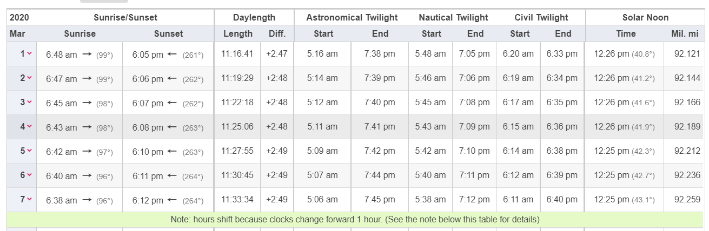

\clearpage

<!-- start the intro on a new page -->

# Introduction

According to the @iowadot, there are over 50,000 crashes per year in Iowa alone. These crashes cause millions of dollars in property damage and, unfortunately, the loss of life, with over 300 people dying in vehicular crashes each year. It is important to gain a greater understanding of the causes of these crashes to better create prevention strategies and protect the drivers on the road. By informing drivers of potential hazardous practices, they will be better prepared and encouraged to follow safe driving practices. The goal of this report is to explore some of the correlations between crashes and driving conditions to gain a better understanding of how to make the road a safer place.

<!--# The Data-->

```{r setup, cache=FALSE, echo = FALSE, message = FALSE, results = FALSE, warning = FALSE}
knitr::opts_chunk$set(echo=FALSE, message=FALSE, warning=FALSE, cache=TRUE, fig.align = "center", out.width = "0.9\\columnwidth")

library("gridExtra")
library(tidyverse)
library(rvest)
library(dplyr)
library(hms)
library(ggthemes) # install.packages("ggthemes")
library(ggtext) # install.packages("ggtext")
```

```{r data, echo = FALSE, message = FALSE, results = FALSE, warning = FALSE}
#Use this if the below code doesn't work - file must be stored on your device under the same folder.
#crashes <- read_csv("../../Vehicle_Crashes_in_Iowa.csv")

crashes <- read_csv("https://media.githubusercontent.com/media/nathanrethwisch/Team-Pufferfish/main/Vehicle_Crashes_in_Iowa.csv")
```

The data for this project is collected by the Iowa Department of Transportation and made publicly available at \url{https://icat.iowadot.gov/}. Each row contains data for every recorded vehicle crash since January 2009 and is updated monthly. For each crash, a large number of variables are collected: date, time and location of the crash, the number of vehicles and passengers involved; crash severity measured in property damage, number of injuries, or fatalities; contributing factors such as weather and road conditions are reported, and whether any of the drivers were driving under the influence.

```{r wrangling, echo = FALSE, message = FALSE, results = FALSE, warning = FALSE}
#Making blank and N/A value in NA
crashes$`City Name`[crashes$`City Name` == ""] <- NA
crashes$`County Name`[crashes$`County Name` == ""] <- NA
crashes$`Route with System`[crashes$`Route with System` == ""] <- NA
crashes[crashes=="N/A"]<-NA

#Total Number of Occupants is sometimes listed as 777 which is illogical
crashes$`Total Number of Occupants`[crashes$`Total Number of Occupants` == 777] <- NA


#Checking NA sums after we made changes to the dataset
colSums(is.na(crashes))

```

```{r wrangling2, echo = FALSE, message = FALSE, warning = FALSE, results = FALSE}
crashes$`Date of Crash` <- lubridate::mdy(crashes$`Date of Crash`)

#Creating a new columns that are separate for year, month, and day
crashes <- crashes%>%
  separate(col = `Date of Crash`, into = c("Year", "Month", "Day"), remove =
             FALSE, sep = "-")
```

```{r wrangling3, echo = FALSE, message = FALSE, warning = FALSE, results = FALSE}
#Getting the distinct latitude and longitude
crashes<- crashes%>%
  separate(col = Location, into = c(NA, "Latitude", "Longitude"), remove =
             FALSE, sep = " ")

crashes<- crashes%>%mutate(Latitude = parse_number(Latitude), Longitude = parse_number(Longitude))
```

Figure \@ref(fig:map) shows a map of all location of crashes in Iowa in 2021. We see that crashes happen everywhere, but there are certain highways and cities that contribute to larger numbers of crashes.

```{r map, fig.cap="Locations of all crashes in Iowa in 2021. Each crash is drawn with an opacity of only 5\\% to provide an x-ray of high-density regions in the spatial distribution. Only when twenty crashes happen in the same location, do we see a fully saturated black dot on the map. The map paints a picture of Iowa's population centers and its network of roads."}
#Map of all crashes in Iowa. This shows that the data comes from all over the state
states <- map_data("state")
crashes%>% filter(Year==2021, Longitude > 40.24) %>%
  ggplot(aes(x = Latitude, y = Longitude)) + 
  geom_path(aes(x = long, y = lat), data = states %>% filter(region=="iowa")) +
  geom_point(alpha = 0.05) +
  ggthemes::theme_map()
```

In our project we are interested in the two of the biggest factors contributing to crashes: alcohol/drug involvement and crashes with animals. For that, we are looking at how

# First overview

Between Jan 1 2009 and the end of September in 2022 a total of 728,442 crashes in Iowa were reported. Figure \@ref(fig:avgcrashes) shows the average number of crashes in Iowa by day of year. We see that during spring and summer months there are on average fewer crashes than during the rest of the year. From November to February, we see an increased variability in the number of crashes -- this is likely due to bad weather days with large number of crashes in some of the years. There is a clear holiday effect in the number of crashes: New Year's day, the Fourth of July, Thanksgiving, Christmas day and the day after have a much-reduced number of crashes. However, both New Year's day and the Fourth of July have a very large number of drunk crashes in comparison to the rest of the year (shown in orange). The fact that New Year's day has triple the number of drug-involved crashes as any other day is particularly scary because January first has the lowest amount of overall crashes in the month of January. We will further investigate the relationship between alcohol and crashes in section IV.

````{=html}
<!--Finally, I looked at crashes by day of the year. There is no real pattern in by day of the year, but there are a few outliers. Both New Year's day and the Fourth of July have a very large amount of drunk crashes in comparison to the rest of the year. This first graph shows all drug-related crashes:

```{r, eval=FALSE, results = FALSE, echo = FALSE, warning = FALSE, message = FALSE}
# Plot of crashes with drug usage by day of the year
c %>%
  filter(Drug_Usage == TRUE) %>%
  ggplot(aes(x=Day)) + geom_bar() + facet_wrap(~Month)
# No real pattern except for two huge outliers, New Year's Day and the Fourth of # July
```
-->
````

```{r avgcrashes, out.width="\\columnwidth", fig.cap="Average number of crashes by day of the year."}

## Plot of all crashes by day of the year
#c %>%
#  ggplot(aes(x=Day)) + geom_bar() + facet_wrap(~Month)

drugs <- crashes %>% 
  mutate(Drug_Usage = 
           (`Drug or Alcohol` != "None Indicated") &
           (`Drug or Alcohol` != "Refused")) %>%
  filter(Drug_Usage == TRUE) %>%
  group_by(Year, Month, Day) %>% count() %>% 
  ungroup(Year) %>% summarize(avg=mean(n))

# Plot of average number of crashes by day of the year
crashes %>% group_by(Year, Month, Day) %>% count() %>% 
  ungroup(Year) %>% summarize(avg=mean(n)) %>% ggplot(aes(x=as.numeric(Day),y=avg)) + 
  geom_bar(stat="identity", fill="grey50") + 
  geom_bar(aes(y=avg*7), stat="identity", data = drugs, fill="darkorange") + 
  facet_wrap(~Month) + theme_bw() + 
  xlab("Day of the Month") +
  scale_y_continuous(
    limits=c(0,225),
    breaks = c(0,70, 140,210),
    # Features of the first axis
    name = "Average number of crashes",
    # Add a second axis and specify its features
    sec.axis = sec_axis(~./7, name="Drugs (alcohol) involved")
  ) +
  theme(
    axis.title.y = element_text(color = "grey50", size=13),
    axis.text.y = element_text(color = "grey50"),
    axis.title.y.right = element_text(color = "darkorange", size=13),
    axis.text.y.right = element_text(color = "darkorange")
  )
```

Figure \@ref(fig:daytime) shows bar charts of the average number of car crashes over the course of a day throughout the months of the year. Initially, we see two prominent peaks in the number of crashes around the times of morning and evening commutes. However, in late spring a third peak appears at a later time that only disappears by September and merges to a single huge peak with the evening commuting time in November. Looking at crashes involving animals we see that this third peak is strongly correlated with the time that animals are hit in the evening. We look at this phenomenon closer in section III.

```{r daytime, fig.cap="Average number of crashes by hour of the day and month of the year. Crashes involving animal hits are shown in orange.",  out.width="\\columnwidth"}
animals <- crashes %>% filter(`Major Cause`=="Animal") %>% group_by(Year, Month, Hour) %>% count() %>% 
  ungroup(Year) %>% summarize(avg=mean(n))

crashes %>% group_by(Year, Month, Hour) %>% count() %>% 
  ungroup(Year) %>% summarize(avg=mean(n)) %>% ggplot(aes(x=parse_number(Hour),y=avg)) + 
  geom_bar(stat="identity", fill="grey50") +
    geom_bar(fill="darkorange", stat="identity", data = animals) +
  facet_wrap(~Month, ncol=4) +
  scale_x_continuous("Hour of the day", breaks=c(6,12,18)) +
  ylab("") + 
  ggtitle("Average number of crashes <span style='color:#ff8c00'>involving animal hits</span><br>by hour of the day and month of the year") +
  theme_bw() +
  theme(
    plot.title = element_markdown(lineheight = 1.1)) +
  scale_fill_manual("", values=c("darkorange"))
```

# Sunrise/Sunset Analysis

Our initial data analysis shows a potential correlation between animal-related crashes and the dawn and dusk hours. We wanted to delve deeper into this idea to see what exactly could be causing this spike in animal-related crashes.

## Data Extraction

Because evening and morning times are variable throughout the year, we felt that it was appropriate to look at when the sun is rising and setting. Because this data was not included in the provided data from \url{https://icat.iowadot.gov/}, we scraped the data from @timeanddate. The data that was scraped includes sunrise and sunset times for Ames, Iowa in 2020. Ames was used because it is the nearest major town to the geographical center of Iowa. This limits variation of sunrise and sunset times based on location. For approximately every 70 miles, there is a one minute change in sunrise and sunset times. By using Ames, these discrepancies were limited to under three minutes. The year 2020 was chosen because it is the most recent leap year and would provide data for February 29th.

Figure \@ref(fig:timeanddate) shows an example table from @timeanddate that was used for the data collection.

```{r timeanddate, fig.cap="Example table of the data collected for sunrise and sunset times."}

```

```{r load_sun}
if (!file.exists("../data/ames-sunset-sunrise-2020.csv")) source("../code/timeanddata-scrape.R")

sun <- read_csv("../data/ames-sunset-sunrise-2020.csv")
```

```{r, echo = FALSE, message = FALSE, results = FALSE}
crashes$Month<- gsub("Month ", "\\1", crashes$Month)
crashes$Month<- parse_integer(crashes$Month)

crashes$Day <- sub("^0+", "", crashes$Day)       
crashes$Day<- parse_integer(crashes$Day)
```

```{r, echo = FALSE, message = FALSE, results = FALSE}
#I needed to convert the Date back to integer so I could join with original data
sun$Date <- as.integer(sun$Date)
  
#Joining the original data and scraped data by day and month
df<- left_join(crashes, sun, by = c("Day" = "Date", "Month" = "Month"))
```

```{r, echo = FALSE, message = FALSE, results = FALSE}
#Finding the difference between the sunset time and the time of the crash
df$sunsetDiff = difftime(df$`Time of Crash`, df$`Sunset Time`, unit = 'mins')
df$sunriseDiff = difftime(df$`Time of Crash`, df$`Sunrise Time`, unit = 'mins')
df$sunDiff <- with(df,pmin(abs(sunsetDiff), abs(sunriseDiff)))

```

## Sunrise/Sunset Analysis

```{r sunrise, results = FALSE, echo= FALSE, warning = FALSE, echo = FALSE, fig.cap="All crashes shown by the difference between crash time and sunrise."}
#A graph of all crashes by the difference between crash time and sunrise
sunr<- df%>%
  filter(`Major Cause` == "Animal")%>%
  group_by(sunriseDiff)%>%
  summarise(n = n())%>%
  ggplot(aes(x = sunriseDiff, y = n)) + geom_line() + ylab("Number of Crashes") + xlab("Minutes From Sunrise") + geom_vline(xintercept = 0) + ggtitle("Animal Crashes vs. Sunrise Time") + xlim (-500,500)
```

After joining the two data sets, we used sunrise and sunset times to calculate the number of minutes each crash was away from when the sun set or rose. We then compared this to the number of animal-related crashes in Iowa.

Figure \@ref(fig:sunTime) plots crashes in comparison to both sunrise and sunset time. Sunrise is plotted on the left, with a line denoting when the sun rises. This there is a small spike, beginning approximately 100 minutes before the sun rises. However, after the sun has risen, the number of animal-related crashes reduces drastically. One explanation for this is that an increased number of drivers are on the road during the rush hour which often falls just before sunrise. Due to low visibility which decreases reaction time, drivers may be more likely to cause a vehicular accident.

The right graph in Figure \@ref(fig:sunTime) plots crashes in terms of minutes away from sunset. Sunset time is denoted by a vertical line. This shows the reverse phenomenon - crashes start to spike *after* the sun has set. According to the @duskdawn, driving at dusk is extremely dangerous, as one's eyes take time to adjust to the relative darkness, shadows hide animals and road features, and driver sometimes fail to turn on their headlights. This may be a reason why there is such a strong correlation between sunset time and a spike in car crashes.

```{r sunset, echo = FALSE, warning = FALSE, message = FALSE, fig.cap="All crashes shown by the difference between crash time and sunset"}
#A graph of all crashes by the difference between crash time and sunset

suns<- df%>%
  filter(`Major Cause` == "Animal")%>%
  group_by(sunsetDiff)%>%
  summarise(n = n())%>%
  ggplot(aes(x = sunsetDiff, y = n)) + geom_line()+geom_vline(xintercept = 0)+ xlab("Minutes from Sunset")+ylab("Number of Crashes") + ggtitle("Animal Crashes vs. Sunset Time") + xlim(-500,500)
```

```{r sunTime, echo = FALSE, warning = FALSE, message = FALSE, fig.cap = "A comparison of animal-related crashes with minutes away from sunrise (left) and minutes away from sunset(right)"}
grid.arrange(sunr, suns, ncol = 2)
```

## Daylight Analysis

One point of note is looking into how the length of the day affects car crashes. Figure \@ref(fig:daylight)shows the number of crashes based on the length of the day. A line of best fit was added to the graph using LOESS (Locally Weighted Scatterplot Smoothing).

```{r daylight, echo = FALSE, warning = FALSE, message = FALSE, fig.cap = "A graph of crashes by length of the day, with a line fit using LOESS smoothing"}
df%>%
  group_by(Daylight)%>%
  summarise (n = n())%>%
  ggplot(aes(x = Daylight, y = n)) + geom_point() + ylab("Number of Crashes") + geom_smooth(span = 0.3)
```

While there is more variability in earlier months, there is very clearly a downward trend, showing that there is a correlation to fewer daylight hours and more crashes. This is likely due to colder weather causing poor road conditions in the winter months, as well as an increase in drivers during dusk and dawn. As previously noted, dusk and dawn prove to be some of the most dangerous times to drive.

# Alcohol Analysis

For the next part of our analysis, we looked into the relationship between alcohol/drug usage and car crashes. Our previous analysis showed that certain days of the year had significant spikes in alcohol-related accidents. Our exploration focuses on the difference alcohol use while driving makes compared to driving sober.

```{r, results = FALSE, echo = FALSE, warning = FALSE, message = FALSE}

# Creates new data set to do modifications on
crash <- crashes

# Changes the drug or alcohol column to a factor so that all the levels can be
# found
crash$`Drug or Alcohol` <- as.factor(crash$`Drug or Alcohol`)

# Finds the levels of the column
levels(crash$`Drug or Alcohol`)

crash %>%
  filter( (`Drug or Alcohol` == "None Indicated") | (`Drug or Alcohol` == "Refused")) %>%
  select(`Drug or Alcohol`)

# Creates new column that combines all the levels of substance abuse
crash <- crash %>%
  mutate(Drug_Usage = 
           (`Drug or Alcohol` != "None Indicated") &
           (`Drug or Alcohol` != "Refused"))

```

```{r, results = FALSE, echo = FALSE, warning = FALSE, message = FALSE}
# Total number of crashes without substance abuse
(false_rows <- crash %>%
  filter(Drug_Usage == FALSE) %>%
  select(`Amount of Property Damage`) %>%
  nrow())

# Total amount of crashes with substance abuse
(true_rows <- nrow(crash) - false_rows)
```

## Property Damage

We found that although crashes while under the influence are less common, they cause almost \$3000 more damage, on average. Figure \@ref(fig:property)shows the difference in property damage between drunk and sober crashes.

```{r, results = FALSE, echo = FALSE, warning = FALSE, message = FALSE}
# Total cost of crashes without substance abuse
(false_total_cost <- crash %>%
  filter(Drug_Usage == FALSE) %>%
  select(`Amount of Property Damage`) %>%
  sum(na.rm=TRUE))

# Total cost of crashes with substance abuse
(true_total_cost <- crash %>%
  filter(Drug_Usage == TRUE) %>%
  select(`Amount of Property Damage`) %>%
  sum(na.rm=TRUE))
  
# Average property damage of crash without substance abuse
avg_Sober<- false_total_cost / false_rows

# Average property damage of crash with substance abuse
avg_Drunk <- true_total_cost / true_rows

avg_Sober<- format(round(avg_Sober, 2), nsmall = 2)
avg_Drunk <- format(round(avg_Drunk, 2), nsmall = 2)


```

```{r property, echo = FALSE, warning = FALSE, message = FALSE, fig.cap = "A plot of the differnce between average property damage among sober drivers and drivers under the influence of drugs and alcohol"}
dat <- paste0("$", c(avg_Sober, avg_Drunk))


crash %>%
  group_by(Drug_Usage) %>%
  summarise(mean = mean(`Amount of Property Damage`,na.rm=TRUE)) %>%
  ggplot(aes(x=Drug_Usage, y=mean, fill = Drug_Usage)) + 
  geom_col() + xlab("Alcohol Usage") + ylab("Average Property Damage") +
  ggtitle("Average Property Damage by Alcohol Usage") + scale_x_discrete(labels=c("No Drugs Present", "Drugs Present"))+ geom_text(aes(label = dat), vjust = -0.2) + scale_fill_discrete("Drug Usage", 
                      labels=c("No Drugs Present", "Drugs/Alcohol Present"))
```

We also looked into the average number of fatalities with and without the use of alcohol. While sober, 1 in 127 crashes (0.79%) result in a fatality. However, when drugs or alcohol are present, fatalities happen in 1 of every 20 crashes (5%). The presence of drugs and alcohol leads to an unprecedented rise in fatality rate.

```{r, results = FALSE, echo = FALSE, warning = FALSE, message = FALSE}
# Total number of fatalities with and without substance abuse
(false_total_fatal <- crash %>%
  filter(Drug_Usage == FALSE) %>%
  select(`Number of Fatalities`) %>%
  sum(na.rm=TRUE))

(true_total_fatal <- crash %>%
  filter(Drug_Usage == TRUE) %>%
  select(`Number of Fatalities`) %>%
  sum(na.rm=TRUE))

# Average fatalities per accident without substance abuse
false_total_fatal / false_rows

# Average fatalities per accident with substance abuse
true_total_fatal / true_rows

```

```{r, results = FALSE, echo = FALSE, warning = FALSE, message = FALSE}
crash <- crash %>%
  mutate(Hour = parse_number(Hour))

# Plot of all crashes by the hour
gg1<- crash %>%
  ggplot(aes(x=Hour)) + geom_bar() + ggtitle("Crashes among all drivers") + ylab("Number of Crashes")
# Most crashes happen during "rush hour" from 4 to 6 P.M.

# Plot of all crashes with sustance abuse by the hour
gg2<- crash %>%
  filter(Drug_Usage == TRUE) %>%
  ggplot(aes(x=Hour)) + geom_bar()+ ggtitle("Crashes among drunk drivers") + ylab("Number of Crashes")
# Most crashes with substances involved happen from 11 P.M. to 3 A.M.
```

## Time of Day

Next we looked at when crashes happened among drivers. Similar to our analysis in section II, we found that there were spikes in crashes at sunrise and sunset hours. However, as shown in figure \@ref(fig:crashHour)crashes are inverted among drunk drivers, with most crashes happening between 11pm and 3 am.

```{r crashHour, warning = FALSE, echo = FALSE, fig.cap = "Crashes by hour shown across all drivers(left) and inebriated drivers (right)"}
grid.arrange(gg1, gg2, ncol = 2)
```

```{r, results = FALSE, echo = FALSE, warning = FALSE, message = FALSE}
# Contains only crashes occuring between 10 P.M. and 4 A.M.
c_night <- crash %>%
  filter(Hour >= 22 | Hour <= 4)

# Total number of night crashes
(total_night <- nrow(c_night))

# Total number of crashes with drug usage during the night
(true_total_night <- c_night %>%
  filter(Drug_Usage == TRUE) %>%
  nrow())
```

```{r, results = FALSE, echo = FALSE, warning = FALSE, message = FALSE}
# Crashes with substances are 4% of all crashes
true_rows / nrow(crash)

# Crashes with substances are 14% of all crashes from 10 P.M. to 3 A.M.
true_total_night / total_night

```

```{r, results = FALSE, echo = FALSE, warning = FALSE, message = FALSE}
# Plot of all crashes by day of the week
w1 <- crash %>%
  ggplot(aes(x=`Day of Week`)) + geom_bar() + theme(axis.text.x = element_text(angle = 90)) + coord_flip() + ylab ("Number of Crashes") + ggtitle("Crashes Among All Drivers")
# Crashes occur pretty much uniformly throughout the week
#
# Slight uptick on Friday, people driving home more recklessly to get
# home faster?

# Plot of all crashes with substance abuse by day of the week
w2<- crash %>%
  filter(Drug_Usage == TRUE) %>%
  ggplot(aes(x=`Day of Week`)) + geom_bar() + theme(axis.text.x = element_text(angle = 90)) + coord_flip() + ylab("Number of Crashes") + ggtitle("Drunk Crashes")
# Majority of these crashes occur on the weekends, Saturday and Sunday are
# likely higher than Friday because they happen early in the "morning" after
# Friday and Saturday nights

```

In addition, we have analyzed drug-related crashes by day of the week. We expected to see a large spike in drunk crashes on the weekends, especially Saturday. Figure \@ref(fig:crashDay) shows a comparison between crashes among all drivers and those under the influence of drugs.

```{r crashDay, warning = FALSE, message = FALSE, echo = FALSE, fig.cap= "Crashes among all days shown among all drivers (left) and drivers operating under the influence (right)"}
grid.arrange(w1, w2, ncol = 2)
```

Among all drivers, Friday is the most common day for car crashes. One explanation for this is that more people are on the road due to weekend travel. Drunk drivers, however, tend to crash more often on Sundays and Saturdays. This is likely due to drinking on Friday and Saturday night which leads to crashes early on Saturday and Sunday morning.

```{r, eval = FALSE, results = FALSE, echo = FALSE, warning = FALSE, message = FALSE}
# Plot of crashes by days in January
crash %>%
  filter(Month == 1) %>%
  ggplot(aes(x=Day)) + geom_bar()
# New Year's Day actually has the least amount of crashes in January, but the
# most amount of drunk crashes
```

# Conclusion

Based on our data, we found sufficient evidence that the dawn and dusk hours cause a significant increase in animal-related crashes due to increased animal activity, the adjustment of driver's eyes, and failure to adequately turn on headlights. We also found that alcohol and drugs significantly impair a driver's ability, leading to a drastic increase in fatalities and property damage. These crashes are concentrated at night and during the weekends.

From these findings, we recommend that drivers be further informed about the dangers of driving immediately after sunset. Furthermore, vehicle manufacturers can take precautions to ensure lights turn on at a certain darkness level. Our analysis also supports ongoing efforts to educate drivers about the dangers of being inebriated while operating a motor vehicle. Those efforts should be continued as they are important to keeping the roads safe.

Some limitations of our analysis include the lack of exact positional data for all sunrise and sunset times. Although we reduced variability in our model as much as possible, we did not account for changes in elevation, and differences location can account for up to three minutes of error when analyzing sunset and sunrise times.

Regardless, these limitations provide minimal challenges to the results of our findings. We would however, recommend an analysis of rush hour traffic and its effect on the prevalence of vehicular accidents. Overall, our findings may motivate drug and alcohol prevention programs, as well as inform research into safety measures that can be applied to mitigate the adverse effects of dusk driving.

<!-- conference papers do not normally have an appendix -->

\clearpage

# Appendix {#appendix .unnumbered}

## Data Cleaning/Processing

Data cleaning included changing empty strings and illogical values into NA values. Day, month, and year values were extracted using R's lubridate package. Latitude and longitude columns were also created from the 'Position' column to further explore where crashes happen in Iowa.

Information scraped from @timeanddate included hours of daylight, sunrise and sunset time, and date. Each month of the year was contained in a separate url which was a challenge of scraping the data. Furthermore, conditional cases of time changes presented additional challenges.

The main data set has a variable titled "Drug or Alcohol" with eight different levels. However, only two of these levels signify that substances were not involved. Because of this, we created a helper variable titled "Drug_Usage" that is TRUE when there are substances involved and FALSE when there is none present.

\clearpage

# References {#references .numbered}
