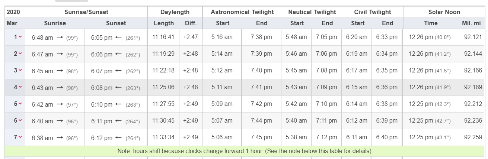

---
output:
  html_document: default
---

# Analysis of Vehicular Crashes in Iowa

##### December 6, 2022

## Introduction

According to the Iowa Department of Transportation, there are over 50,000 crashes per year~1~. These crashes cause millions in property damage, and unfortunately, the loss of life, with over 300 people dying to vehicular crashes per year. It is important to gain a greater understanding of the causes of these crashes in order to better create prevention strategies and protect the drivers on the road. Furthermore, by informing drivers of potential hazardous practices, they will be better prepared and encouraged to follow safe driving practices. The goal of this report is to explore some of the correlations between crashes and driving conditions to gain a better understanding of how to make the road a safer place.

## The Data

```{r, echo = FALSE, message = FALSE, results = FALSE, warning = FALSE}
library(tidyverse)
library(rvest)
library(dplyr)
library(hms)


#Use this if the below code doesn't work - file must be stored on your device under the same folder.
#crashes <- read_csv("../Vehicle_Crashes_in_Iowa.csv")

crashes <- read_csv("https://media.githubusercontent.com/media/nathanrethwisch/Team-Pufferfish/main/Vehicle_Crashes_in_Iowa.csv")
```

This data set comes from the Iowa Department of Transportation contains data for every recorded vehicle crash since January 2009. It is updated monthly by the Iowa Department of Transportation,

In total there are 728,442 observations in the data set and 37 variables, which included information on data and time of crash, location, number of injuries or fatalities, weather and road conditions, property damage, the number of passengers, and whether or not the driver was under the influence.

```{r, echo = FALSE, message = FALSE, results = FALSE, warning = FALSE}
#Making blank and N/A value in NA
crashes$`City Name`[crashes$`City Name` == ""] <- NA
crashes$`County Name`[crashes$`County Name` == ""] <- NA
crashes$`Route with System`[crashes$`Route with System` == ""] <- NA
crashes[crashes=="N/A"]<-NA

#Total Number of Occupants is sometimes listed as 777 which is illogical
crashes$`Total Number of Occupants`[crashes$`Total Number of Occupants` == 777] <- NA


#Checking NA sums after we made changes to the dataset
colSums(is.na(crashes))

```

```{r, echo = FALSE, message = FALSE, warning = FALSE, results = FALSE}
crashes$`Date of Crash` <- lubridate::mdy(crashes$`Date of Crash`)

#Creating a new columns that are separate for year, month, and day
crashes <- crashes%>%
  separate(col = `Date of Crash`, into = c("Year", "Month", "Day"), remove =
             FALSE, sep = "-")
```

```{r, echo = FALSE, message = FALSE, warning = FALSE, results = FALSE}
#Getting the distinct latitude and longitude
crashes<- crashes%>%
  separate(col = Location, into = c(NA, "Latitude", "Longitude"), remove =
             FALSE, sep = " ")

crashes<- crashes%>%mutate(Latitude = parse_number(Latitude), Longitude = parse_number(Longitude))
```

```{r, warning = FALSE, echo = FALSE, results = FALSE}
#Map of all crashes in Iowa. This shows that the data comes from all over the state
crashes%>%
      ggplot(aes(x = Latitude, y = Longitude)) + geom_point()
```

## Sunrise/Sunset Analysis

## Sunrise/Sunset Analysis

After cleaning the data, our analysis focused on how time of the day when car crashes happen. We hypothesize that more crashes will happen in the morning and evening as the driver is travelling into the sun and has to deal with sun glare, preventing them from seeing clearly.

### Data Extraction

Because evening and morning times are variable throughout the year, one must look at when the sun is rising and setting. Because this data was not included in the original data set, the data was scraped from timeanddate.com. The data includes sunrise and sunset times for Ames, Iowa in 2020. The reasoning behind using Ames was that it is the nearest major town to the geographical center of Iowa. This would limit variation of sunrise and sunset times based on location. For approximately every 70 miles, there is a one minute change in sunrise and sunset times. By using Ames, these discrepancies to under three minutes. The year 2020 was chosen because it is the most recent leap year and would provide meaningful data for February 29.

The table that was used for the data collection is as follows:



Using a function, the data was extracted for each month in 2020 and joined with the original crash data set.

```{r, results = FALSE, echo = FALSE, warning = FALSE, message = FALSE}
#Using rvest to extract sunrise and sunset data
#A function that takes in the url and month number
dfmonth <- function(url, number) {
  
#Extraction of the table
page <- read_html(url)
tables <- page %>% html_table(fill = TRUE)
tables %>% str
weather<- tables[[2]]

#Setting names to date, sunrise, and sunset
names(weather)[1] <- "Date"
names(weather)[2] <- "Sunrise"
names(weather)[3] <- "Sunset" 
names(weather)[4] <- "Daylight"


#The first day for each month in the dataframe is in it's own column, so I created a new dataframe with the pertinent intformation and renamed those columns
weather2 <-weather[14:17]
names(weather2)[1] <- "Date"
names(weather2)[2] <- "Sunrise"
names(weather2)[3] <- "Sunset"
names(weather2)[4] <- "Daylight"

#I then changed the Date to a character so it can be merged with the other data
weather2$Date <- as.character(weather2$Date)

#I select only the pertinent data from the original weather data set
weather <- weather[1:4]

#Next, I join the data sets while omitting NA values
final_weather <- full_join(na.omit(weather), na.omit(weather2))

#The first day in the dataset will be at the end, so I move it towards the front
final_weather[1,]<- final_weather[nrow(final_weather),]

#Next, I remove the labels that stuck onto this dataset that are unnecessary
final_weather <- final_weather[-2,]

#The last two rows are removed because they contain a copy of day 1 and some additional information from the webpage
final_weather <- final_weather[-nrow(final_weather)+1: -nrow(final_weather),]

#These loops are to deal with notices for time changes. If there is a time change notice in the dataframe, they are removed.
if (any(final_weather == "Note: hours shift because clocks change forward 1 hour. (See the note below this table for details)")){
  final_weather <-final_weather[-which(final_weather$Sunrise ==  "Note: hours shift because clocks change forward 1 hour. (See the note below this table for details)"),]
} else if (any(final_weather == "Note: hours shift because clocks change backward 1 hour. (See the note below this table for details)")){
  final_weather <- final_weather[-which(final_weather$Sunrise == "Note: hours shift because clocks change backward 1 hour. (See the note below this table for details)"),]
}

#Creating a new column that corresponds to the month number
final_weather$Month <- number
  
#Seperating additional informatoin from the sunset and sunrise times in the graph
final_weather<-final_weather%>%
  separate(col = Sunrise, into = c("Sunrise Time", NA), remove = TRUE, sep = " ↑")

final_weather<-final_weather%>%
  separate(col = Sunset, into = c("Sunset Time", NA), remove = TRUE, sep = " ↑")

#Making the sunset time in Hour:Minute:Second format
final_weather$`Sunset Time` <- format(strptime(final_weather$`Sunset Time`, "%I:%M %p"), format="%H:%M:%S")

final_weather$`Sunrise Time` <- format(strptime(final_weather$`Sunrise Time`, "%I:%M %p"), format="%H:%M:%S")


#Making the data type of sunset and sunrise an hms so it can be compared to the original data
final_weather$`Sunrise Time` <- as_hms(final_weather$`Sunrise Time`)
final_weather$`Sunset Time` <- as_hms(final_weather$`Sunset Time`)
final_weather$`Daylight` <- as_hms(final_weather$`Daylight`)

#Returns the altered dataframe
  return (final_weather)
}

```

```{r, results = FALSE, echo = FALSE, warning = FALSE, message = FALSE}
#Creating a dataframe using my previous function in the month January
#I'm choosing 2020 because it is the most recent leap year - so I will have data for February 29th. I'm choosing Ames because it is close to the geographical center of Iowa
sun<- dfmonth("https://www.timeanddate.com/sun/@4846834?month=1&year=2020", 1)

#For the rest of the months, I run this loop and join them with the dataframe
for (i in 2:12){
  url<- paste0("https://www.timeanddate.com/sun/@4846834?month=", i, "&year=2020")
  dfTemp<- dfmonth(url, i)
  sun<- full_join(sun, dfTemp)
  
}

#Checking if there are any null values 
sum(is.na(sun$`Sunrise Time`))
sum(is.na(sun$`Date`))
sum(is.na(sun$`Sunset Time`))
sum(is.na(sun$`Daylight`))
```

```{r, echo = FALSE, message = FALSE, results = FALSE}
crashes$Month<- gsub("Month ", "\\1", crashes$Month)
crashes$Month<- parse_integer(crashes$Month)

crashes$Day <- sub("^0+", "", crashes$Day)       
crashes$Day<- parse_integer(crashes$Day)
```

```{r, echo = FALSE, message = FALSE, results = FALSE}
#I needed to convert the Date back to integer so I could join with original data
sun$Date <- as.integer(sun$Date)
  
#Joining the original data and scraped data by day and month
df<- left_join(crashes, sun, by = c("Day" = "Date", "Month" = "Month"))
```

```{r, echo = FALSE, message = FALSE, results = FALSE}
#Finding the difference between the sunset time and the time of the crash
df$sunsetDiff = difftime(df$`Time of Crash`, df$`Sunset Time`, unit = 'mins')
df$sunriseDiff = difftime(df$`Time of Crash`, df$`Sunrise Time`, unit = 'mins')
df$sunDiff <- with(df,pmin(abs(sunsetDiff), abs(sunriseDiff)))

```

### Sunrise/Sunset Analysis

The below graph shows the minutes from sunrise compared to number of crashes, with a line denoting when the sunrise time is:

```{r, echo = FALSE, warning = FALSE, message = FALSE}
#A graph of all crashes by the difference between crash time and sunrise
df%>%
  group_by(sunriseDiff)%>%
  summarise(n = n())%>%
  ggplot(aes(x = sunriseDiff, y = n)) + geom_line() + ylab("Number of Crashes") + xlab("Minutes From Sunrise") + geom_vline(xintercept = 0)
```

This clearly appears that there is a small spike, starting right before the sun rises.

There also seems to be a noticeable spike around 750 minutes after sunrise time. This likely corresponds to sunset time, so it is only logical to look at how sunset time affects car crashes. The below graph shows the minutes away from sunset, with a line denoting where the sun sets.

```{r, echo = FALSE, warning = FALSE, message = FALSE}
#A graph of all crashes by the difference between crash time and sunset
df%>%
  group_by(sunsetDiff)%>%
  summarise(n = n())%>%
  ggplot(aes(x = sunsetDiff, y = n)) + geom_line()+geom_vline(xintercept = 0)+ xlab("Minutes from Sunset")+ylab("Number of Crashes")
```

There appears to be a pretty drastic jump right after the sun sets. According to the Delaware Safety Council~2~, driving at dusk is extremely dangerous, as one's eyes take time to adjust to the relative darkness, shadows hide animals and road features, and driver sometimes fail to turn on their headlights. This may be a reason why there is such a strong correlation between sunset time and a spike in car crashes.

### Daylight Analysis

One point of note is looking into how the length of the day affects car crashes. The following graph shows the number of crashes based on the length of the day. A line of best fit was added to the graph using LOESS smoothing.

There seems to be more variability in earlier months, but overall a downward trend.

```{r, echo = FALSE, warning = FALSE, message = FALSE}
df%>%group_by(Daylight)%>%
  summarise (n = n())%>%
  ggplot(aes(x = Daylight, y = n)) + geom_point() + ylab("Number of Crashes") + geom_smooth(span = 0.3)
```

There is very clearly a downward trend, showing that there is a correlation to fewer daylight hours and more crashes.

### Conclusion:

A number of conclusions can be drawn from this data analysis. First, we can conclude that there is a correlation between sunset and sunrise time and frequency of crashes. The 30-minute window after the sun sets, especially, is correlated with an increase in crashes in Iowa. There is also a correlation between higher numbers of crashes and fewer daylight hours, but this may be correlated with the winter months being more dangerous for drivers. For future research, we would like to to further look into how rush hour traffic may affect these statistics.

## Alcohol Analysis

For my analysis, I would like to look into the relationship between alcohol and car crashes. I especially want to look into how the severity of car crashes and alcohol are related and what times are the most dangerous in terms of drunk drivers.

The main data set has a variable titled "Drug or Alcohol" with eight different levels. However, only two of these levels signify that sustances were not involved. Because of this I created a helper variable titled "Drug_Usage" that is TRUE when there are substances involved and FALSE when there is none present.

```{r}

# Creates new data set to do modifications on
c <- crashes

# Changes the drug or alcohol column to a factor so that all the levels can be
# found
c$`Drug or Alcohol` <- as.factor(c$`Drug or Alcohol`)

# Finds the levels of the column
levels(c$`Drug or Alcohol`)

c %>%
  filter( (`Drug or Alcohol` == "None Indicated") | (`Drug or Alcohol` == "Refused")) %>%
  select(`Drug or Alcohol`)

# Creates new column that combines all the levels of substance abuse
c <- c %>%
  mutate(Drug_Usage = 
           (`Drug or Alcohol` != "None Indicated") &
           (`Drug or Alcohol` != "Refused"))

```

In order to perform further calculations, I also created some helper variables containing the total of crashes with and without alcohol, respectively.

```{r}
# Total number of crashes without substance abuse
(false_rows <- c %>%
  filter(Drug_Usage == FALSE) %>%
  select(`Amount of Property Damage`) %>%
  nrow())

# Total amount of crashes with substance abuse
(true_rows <- nrow(c) - false_rows)
```

After that, I found the average property damage that results from crashes with and without drunk driving. As I expected, drunk crashes do cause more damage, almost \$3000 more on average.

```{r}
# Total cost of crashes without substance abuse
(false_total_cost <- c %>%
  filter(Drug_Usage == FALSE) %>%
  select(`Amount of Property Damage`) %>%
  sum(na.rm=TRUE))

# Total cost of crashes with substance abuse
(true_total_cost <- c %>%
  filter(Drug_Usage == TRUE) %>%
  select(`Amount of Property Damage`) %>%
  sum(na.rm=TRUE))
  
# Average property damage of crash without substance abuse
false_total_cost / false_rows

# Average property damage of crash with substance abuse
true_total_cost / true_rows

```

I also looked at the average fatalities per crash with and without alcohol. The actual values of the averages aren't super intuitive, as they are small decimals, but finding the average rate of fatalities is much more useful. When doing so, fatalities occur in sober crashes about 1 in 217 crashes, while fatalities in drunk crashes occur at about 1 in 20. This difference in fatality is expected, but I am shocked at how much higher it truly is.

```{r}
# Total number of fatalities with and without substance abuse
(false_total_fatal <- c %>%
  filter(Drug_Usage == FALSE) %>%
  select(`Number of Fatalities`) %>%
  sum(na.rm=TRUE))

(true_total_fatal <- c %>%
  filter(Drug_Usage == TRUE) %>%
  select(`Number of Fatalities`) %>%
  sum(na.rm=TRUE))

# Average fatalities per accident without substance abuse
false_total_fatal / false_rows

# Average fatalities per accident with substance abuse
true_total_fatal / true_rows

```

Next, I decided to look into how time of day affects drunk driving. I plotted sober and drunk crashes and tried to find a pattern.

```{r}
#c <- c %>%
#  mutate(Hour = parse_number(Hour))

# Plot of all crashes by the hour
c %>%
  ggplot(aes(x=Hour)) + geom_bar()
# Most crashes happen during "rush hour" from 4 to 6 P.M.

# Plot of all crashes with sustance abuse by the hour
c %>%
  filter(Drug_Usage == TRUE) %>%
  ggplot(aes(x=Hour)) + geom_bar()
# Most crashes with substances involved happen from 11 P.M. to 3 A.M.
```

After that, I decided to try and find what percentage of crashes that occur during late night hours involve alcohol. To do so, I creates a helper variable containing all crashes that occured between 10 P.M. and 4 A.M.

```{r}
c_night <- c %>%
  filter(Hour >= 22 | Hour <= 3)

(total_night <- nrow(c_night))

(true_total_night <- c_night %>%
  filter(Drug_Usage == TRUE) %>%
  nrow())

# Crashes with substances are 4% of all crashes
true_rows / nrow(c)

# Crashes with substances are 14% of all crashes from 10 P.M. to 3 A.M.
true_total_night / total_night

```

The next unit of time I decided to look at was day of the week. I expected to see a large spike on weekends, especially on Friday and Saturday. To do so, I once again plotted both sober and drunk crashes by day of the week and compared them.

```{r}
# Plot of all crashes by day of the week
c %>%
  ggplot(aes(x=`Day of Week`)) + geom_bar() + theme(axis.text.x = element_text(angle = 45))
# Crashes occur pretty much uniformly throughout the week
#
# Slight uptick on Friday, people driving home more recklessly to get
# home faster?

# Plot of all crashes with substance abuse by day of the week
c %>%
  filter(Drug_Usage == TRUE) %>%
  ggplot(aes(x=`Day of Week`)) + geom_bar() + theme(axis.text.x = element_text(angle = 45))
# Majority of these crashes occur on the weekends, Saturday and Sunday are
# likely higher than Friday because they happen early in the "morning" after
# Friday and Saturday nights

```

Finally, I looked at crashes by day of the year, utilizing multiple graphs to demonstrate the relationships.

```{r}
# Plot of crashes with drug usage by month
c %>%
  filter(Drug_Usage == TRUE) %>%
  ggplot(aes(x=Month)) + geom_bar()
# No real pattern

# Plot of crashes with drug usage by day of the year
c %>%
  filter(Drug_Usage == TRUE) %>%
  ggplot(aes(x=Day)) + geom_bar() + facet_wrap(~Month)
# No real pattern except for two huge outliers, New Year's Day and the Fourth of # July

# Plot of all crashes by day of the year
c %>%
  ggplot(aes(x=Day)) + geom_bar() + facet_wrap(~Month)
# Emphasizes difference between drunk and sober crashes as there is little
# pattern in this graph

# Plot of crashes by days in Decemeber
c %>%
  filter(Month == 12) %>%
  ggplot(aes(x=Day)) + geom_bar()
# The lowest amount of crashes in the whole year happen on Christmas Day

# Plot of crashes by days in January
c %>%
  filter(Month == 1) %>%
  ggplot(aes(x=Day)) + geom_bar()
# New Year's Day actually has the least amount of crashes in January, but the
# most amount of drunk crashes
```

## Conclusions

1.  Alcohol drastically increases the danger and severity of crashes: fatalities, injuries, and property damage all occur at an increased rate.

2.  Nighttime and Friday and Saturday nights are the times with the most drunk driving, so it may be wise to avoid the roads at those times.

3.  The worst nights to drive on are New Year's Eve and the Fourth of July, as they by far have the most drunk accidents of any other days in the year.

## Further Analysis

In the future, a variety of analysis could be performed to improve understanding of car crashes in Iowa. For example, we would be interested in further looking into how rush hour traffic can affect car crashes, especially geographically. Furthermore, looking into temperature trends would also provide insightful analysis.

Another area we would be interested in looking further into is looking at alcohol-related crashes by location. Looking into how alcohol affects the type of crash would also provide useful information.

## Bibliography

1 "Iowa Motor Vehicle Crashes - 1925 to 2020" *Iowa Department of Transportation,* 2022, <https://iowadot.gov/mvd/stats/crashhistory.pdf>.

2 "Safe Driving Dusk and Dawn" *Delaware Safety Council,* <https://delawaresafety.org/resources/> Documents/Safety%20Documents/Safe%20Driving%20-%20%20Dusk%20and%20Dawn.pdf.
