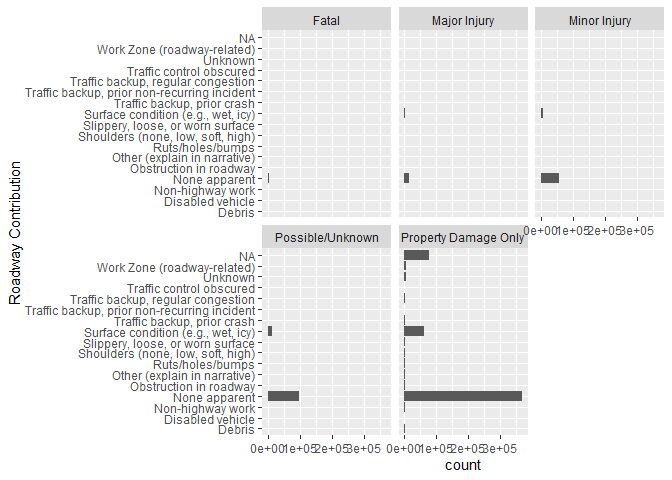
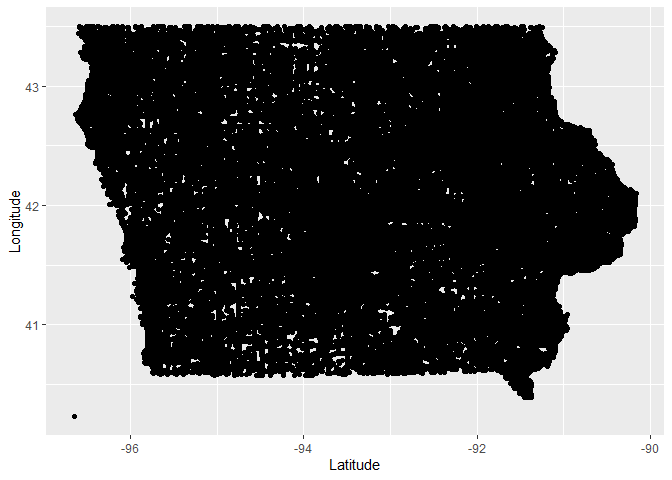

\#I love FORTNITE

I love pufferfish

The goal of our project is to find what variables are most prominent
when causing crashes that are fatal, have significant crash severity, or
cause the most property damage. The variables we are looking at right
now include roadway type, roadway surface, environmental/weather
conditions, and light conditions. Eventually, we would like to create a
model to predict what conditions are most likely to cause serious
injuries.

``` r
#Use this if the below code doesn't work - file must be stored on your device.
#crashes <- read.csv("../Vehicle_Crashes_in_Iowa.csv")
crashes<- read.csv("https://media.githubusercontent.com/media/nathanrethwisch/Team-Pufferfish/main/Vehicle_Crashes_in_Iowa.csv")

View(crashes)
```

``` r
library(tidyverse)
```

    ## ── Attaching packages ─────────────────────────────────────── tidyverse 1.3.2 ──
    ## ✔ ggplot2 3.3.6     ✔ purrr   0.3.4
    ## ✔ tibble  3.1.8     ✔ dplyr   1.0.9
    ## ✔ tidyr   1.2.0     ✔ stringr 1.4.1
    ## ✔ readr   2.1.2     ✔ forcats 0.5.2
    ## ── Conflicts ────────────────────────────────────────── tidyverse_conflicts() ──
    ## ✖ dplyr::filter() masks stats::filter()
    ## ✖ dplyr::lag()    masks stats::lag()

``` r
library(dplyr)
library(tidyr)
library(ggplot2)
dim(crashes)
```

    ## [1] 728442     37

``` r
str(crashes)
```

    ## 'data.frame':    728442 obs. of  37 variables:
    ##  $ Iowa.DOT.Case.Number           : num  2.01e+09 2.01e+09 2.01e+09 2.01e+09 2.01e+09 ...
    ##  $ Law.Enforcement.Case.Number    : chr  "0954" "" "09000001" "09000001" ...
    ##  $ Date.of.Crash                  : chr  "01/01/2009" "01/01/2009" "01/01/2009" "01/01/2009" ...
    ##  $ Month.of.Crash                 : chr  "01-January" "01-January" "01-January" "01-January" ...
    ##  $ Day.of.Week                    : chr  "5-Thursday" "5-Thursday" "5-Thursday" "5-Thursday" ...
    ##  $ Time.of.Crash                  : chr  "15:49" "02:15" "00:14" "04:51" ...
    ##  $ Hour                           : chr  "Hour 16" "Hour 03" "Hour 01" "Hour 05" ...
    ##  $ DOT.District                   : chr  "District 6 (East Central)" "District 4 (Southwest)" "District 5 (Southeast)" "District 3 (Northwest)" ...
    ##  $ City.Name                      : chr  "" "" "" "" ...
    ##  $ County.Name                    : chr  "" "" "" "" ...
    ##  $ Route.with.System              : chr  "" "IA 4" "" "" ...
    ##  $ Location.Description           : chr  "E DOVER CT" "IA 4/IOWA 4 & 170TH ST" "Co Rd J44/520TH ST" "Co Rd L36/D AVE" ...
    ##  $ First.Harmful.Event            : chr  "Collision with:  Parked motor vehicle" "Collision with fixed object:  Other fixed object (explain in narrative)" "Collision with:  Animal" "Non-collision events:  Overturn/rollover" ...
    ##  $ Location.of.First.Harmful.Event: chr  "On Roadway" "Shoulder" "On Roadway" "On Roadway" ...
    ##  $ Manner.of.Crash.Collision      : chr  "Sideswipe, same direction" "Non-collision (single vehicle)" "Non-collision (single vehicle)" "Non-collision (single vehicle)" ...
    ##  $ Major.Cause                    : chr  "Lost Control" "Ran off road - right" "Animal" "Crossed centerline (undivided)" ...
    ##  $ Drug.or.Alcohol                : chr  "None Indicated" "None Indicated" "None Indicated" "Alcohol (Statutory)" ...
    ##  $ Environmental.Conditions       : chr  "None apparent" "None apparent" "Animal in roadway" "None apparent" ...
    ##  $ Light.Conditions               : chr  "Daylight" "Dark - roadway not lighted" "Dark - roadway not lighted" "Dark - roadway not lighted" ...
    ##  $ Surface.Conditions             : chr  "Ice/frost" "Dry" "Dry" "Dry" ...
    ##  $ Weather.Conditions             : chr  "Cloudy" "Clear" "Clear" "Cloudy" ...
    ##  $ Roadway.Contribution           : chr  "None apparent" "None apparent" "None apparent" "None apparent" ...
    ##  $ Roadway.Type                   : chr  "Non-intersection:  Non-junction/no special feature" "Non-intersection:  Non-junction/no special feature" "Intersection:  Other intersection (explain in narrative)" "Non-intersection:  Non-junction/no special feature" ...
    ##  $ Roadway.Surface                : chr  "Paved" "Paved" "Unpaved" "Paved" ...
    ##  $ Work.Zone                      : chr  "N/A" "N/A" "N/A" "N/A" ...
    ##  $ Crash.Severity                 : chr  "Property Damage Only" "Property Damage Only" "Minor Injury" "Property Damage Only" ...
    ##  $ Number.of.Fatalities           : int  0 0 0 0 0 0 0 0 0 0 ...
    ##  $ Number.of.Injuries             : int  0 0 2 0 0 0 1 0 1 1 ...
    ##  $ Number.of.Major.Injuries       : int  0 0 0 0 0 0 0 0 0 0 ...
    ##  $ Number.of.Minor.Injuries       : int  0 0 1 0 0 0 0 0 0 1 ...
    ##  $ Number.of.Possible.Injuries    : int  0 0 1 0 0 0 1 0 1 0 ...
    ##  $ Number.of.Unknown.Injuries     : int  0 0 0 0 0 0 0 0 0 0 ...
    ##  $ Amount.of.Property.Damage      : int  2000 5750 8000 2000 1000 7000 2000 2500 4000 5755 ...
    ##  $ Number.of.Vehicles.Involved    : int  2 1 1 1 1 2 1 2 2 2 ...
    ##  $ Total.Number.of.Occupants      : int  1 1 2 1 1 2 2 4 2 3 ...
    ##  $ Travel.Direction               : chr  "N/A" "N/A" "N/A" "N/A" ...
    ##  $ Location                       : chr  "POINT (-90.567730450144 41.54429908431)" "POINT (-94.367629082433 41.76148937584)" "POINT (-92.944073472578 40.725020835225)" "POINT (-95.799893234639 42.801520512692)" ...

``` r
#NA values are only found in Amount of Property Damage?
colSums(is.na(crashes))
```

    ##            Iowa.DOT.Case.Number     Law.Enforcement.Case.Number 
    ##                               0                               0 
    ##                   Date.of.Crash                  Month.of.Crash 
    ##                               0                               0 
    ##                     Day.of.Week                   Time.of.Crash 
    ##                               0                               0 
    ##                            Hour                    DOT.District 
    ##                               0                               0 
    ##                       City.Name                     County.Name 
    ##                               0                               0 
    ##               Route.with.System            Location.Description 
    ##                               0                               0 
    ##             First.Harmful.Event Location.of.First.Harmful.Event 
    ##                               0                               0 
    ##       Manner.of.Crash.Collision                     Major.Cause 
    ##                               0                               0 
    ##                 Drug.or.Alcohol        Environmental.Conditions 
    ##                               0                               0 
    ##                Light.Conditions              Surface.Conditions 
    ##                               0                               0 
    ##              Weather.Conditions            Roadway.Contribution 
    ##                               0                               0 
    ##                    Roadway.Type                 Roadway.Surface 
    ##                               0                               0 
    ##                       Work.Zone                  Crash.Severity 
    ##                               0                               0 
    ##            Number.of.Fatalities              Number.of.Injuries 
    ##                               0                               0 
    ##        Number.of.Major.Injuries        Number.of.Minor.Injuries 
    ##                               0                               0 
    ##     Number.of.Possible.Injuries      Number.of.Unknown.Injuries 
    ##                               0                               0 
    ##       Amount.of.Property.Damage     Number.of.Vehicles.Involved 
    ##                               9                               0 
    ##       Total.Number.of.Occupants                Travel.Direction 
    ##                               0                               0 
    ##                        Location 
    ##                               0

``` r
#This is strange because it appears that City.Name has NA values
sum(is.na(crashes$City.Name))
```

    ## [1] 0

``` r
#Making blank and N/A value in NA
crashes$City.Name[crashes$City.Name == ""] <- NA
crashes$County.Name[crashes$County.Name == ""] <- NA
crashes$Route.with.System[crashes$Route.with.System == ""] <- NA
crashes[crashes=="N/A"]<-NA

#Making the case number an integer
crashes$Law.Enforcement.Case.Number <- as.integer(crashes$Law.Enforcement.Case.Number)
```

    ## Warning: NAs introduced by coercion

    ## Warning: NAs introduced by coercion to integer range

``` r
#Checking NA sums after we made changes to the dataset
colSums(is.na(crashes))
```

    ##            Iowa.DOT.Case.Number     Law.Enforcement.Case.Number 
    ##                               0                          527840 
    ##                   Date.of.Crash                  Month.of.Crash 
    ##                               0                               0 
    ##                     Day.of.Week                   Time.of.Crash 
    ##                               0                               0 
    ##                            Hour                    DOT.District 
    ##                               0                               4 
    ##                       City.Name                     County.Name 
    ##                          279583                          109894 
    ##               Route.with.System            Location.Description 
    ##                          451161                               0 
    ##             First.Harmful.Event Location.of.First.Harmful.Event 
    ##                            2311                           23872 
    ##       Manner.of.Crash.Collision                     Major.Cause 
    ##                           51205                               0 
    ##                 Drug.or.Alcohol        Environmental.Conditions 
    ##                               0                           63550 
    ##                Light.Conditions              Surface.Conditions 
    ##                           71992                           72352 
    ##              Weather.Conditions            Roadway.Contribution 
    ##                           72784                           79089 
    ##                    Roadway.Type                 Roadway.Surface 
    ##                           68521                           50634 
    ##                       Work.Zone                  Crash.Severity 
    ##                          719474                               0 
    ##            Number.of.Fatalities              Number.of.Injuries 
    ##                               0                               0 
    ##        Number.of.Major.Injuries        Number.of.Minor.Injuries 
    ##                               0                               0 
    ##     Number.of.Possible.Injuries      Number.of.Unknown.Injuries 
    ##                               0                               0 
    ##       Amount.of.Property.Damage     Number.of.Vehicles.Involved 
    ##                               9                               0 
    ##       Total.Number.of.Occupants                Travel.Direction 
    ##                               0                          491785 
    ##                        Location 
    ##                               0

``` r
#Getting the distinct latitude and longitude
crashes<- crashes%>%
  separate(col = Location, into = c(NA, "Latitude", "Longitude"), remove =
             FALSE, sep = " ")
```

    ## Warning: Expected 3 pieces. Missing pieces filled with `NA` in 1 rows [657341].

``` r
crashes<- crashes%>%mutate(Latitude = parse_number(Latitude), Longitude = parse_number(Longitude))
```

``` r
crashes$Date.of.Crash <- lubridate::mdy(crashes$Date.of.Crash)

#Creating a new columns that are separate for year, month, and day
crashes <- crashes%>%
  separate(col = Date.of.Crash, into = c("Year", "Month", "Day"), remove =
             FALSE, sep = "-")
View(crashes)
```

``` r
#Looking at the different crash severities
crashes%>%
  group_by(Crash.Severity)%>%
  summarise(n = n())
```

    ## # A tibble: 5 × 2
    ##   Crash.Severity            n
    ##   <chr>                 <int>
    ## 1 Fatal                  4323
    ## 2 Major Injury          16810
    ## 3 Minor Injury          65801
    ## 4 Possible/Unknown     115784
    ## 5 Property Damage Only 525724

``` r
#Roadway contribution to fatal car accidents
crashes%>%
  filter(Crash.Severity == "Fatal")%>%
  group_by(Roadway.Contribution)%>%
  summarise(n = n())
```

    ## # A tibble: 16 × 2
    ##    Roadway.Contribution                             n
    ##    <chr>                                        <int>
    ##  1 Debris                                           8
    ##  2 Disabled vehicle                                12
    ##  3 Non-highway work                                 2
    ##  4 None apparent                                 3774
    ##  5 Obstruction in roadway                           3
    ##  6 Other (explain in narrative)                    24
    ##  7 Ruts/holes/bumps                                14
    ##  8 Shoulders (none, low, soft, high)               15
    ##  9 Slippery, loose, or worn surface                11
    ## 10 Surface condition (e.g., wet, icy)             306
    ## 11 Traffic backup, prior crash                      5
    ## 12 Traffic backup, prior non-recurring incident     3
    ## 13 Traffic backup, regular congestion               1
    ## 14 Unknown                                         56
    ## 15 Work Zone (roadway-related)                     84
    ## 16 <NA>                                             5

``` r
#The count of roadway contributions by injury severity
crashes%>%
  ggplot(aes(x = Roadway.Contribution)) +geom_bar() + facet_wrap(~Crash.Severity)+coord_flip()
```

<!-- -->

``` r
#Map of all crashes in Iowa
crashes%>%
      ggplot(aes(x = Latitude, y = Longitude)) + geom_point()
```

    ## Warning: Removed 1 rows containing missing values (geom_point).

<!-- -->

``` r
#Crash severity grouped by roadway type
crashes2<- crashes%>%
  group_by(Roadway.Type, Crash.Severity)%>%
  summarise(n = n())
```

    ## `summarise()` has grouped output by 'Roadway.Type'. You can override using the
    ## `.groups` argument.

``` r
crashes2[which.max(crashes2$n),]
```

    ## # A tibble: 1 × 3
    ## # Groups:   Roadway.Type [1]
    ##   Roadway.Type                                       Crash.Severity            n
    ##   <chr>                                              <chr>                 <int>
    ## 1 Non-intersection:  Non-junction/no special feature Property Damage Only 243391

``` r
#The top cause of fatal crashes
crashes3<- crashes%>%
  filter(Crash.Severity == "Fatal")%>%
  group_by(Major.Cause)%>%
  summarise(n = n())

View(crashes3[which.max(crashes3$n),])
```

``` r
#Looking at the top environmental and surface conditions for fatal accidents
Cause_crashes<- crashes%>%
  filter(Crash.Severity == "Fatal")%>%
  group_by(Environmental.Conditions, Light.Conditions, Surface.Conditions, Weather.Conditions)%>%
  summarise(n = n())
```

    ## `summarise()` has grouped output by 'Environmental.Conditions',
    ## 'Light.Conditions', 'Surface.Conditions'. You can override using the `.groups`
    ## argument.

``` r
Cause_crashes%>%filter(n > 100)
```

    ## # A tibble: 5 × 5
    ## # Groups:   Environmental.Conditions, Light.Conditions, Surface.Conditions [3]
    ##   Environmental.Conditions Light.Conditions           Surface.Co…¹ Weath…²     n
    ##   <chr>                    <chr>                      <chr>        <chr>   <int>
    ## 1 None apparent            Dark - roadway lighted     Dry          Clear     246
    ## 2 None apparent            Dark - roadway not lighted Dry          Clear     623
    ## 3 None apparent            Dark - roadway not lighted Dry          Cloudy    175
    ## 4 None apparent            Daylight                   Dry          Clear    1285
    ## 5 None apparent            Daylight                   Dry          Cloudy    463
    ## # … with abbreviated variable names ¹​Surface.Conditions, ²​Weather.Conditions
