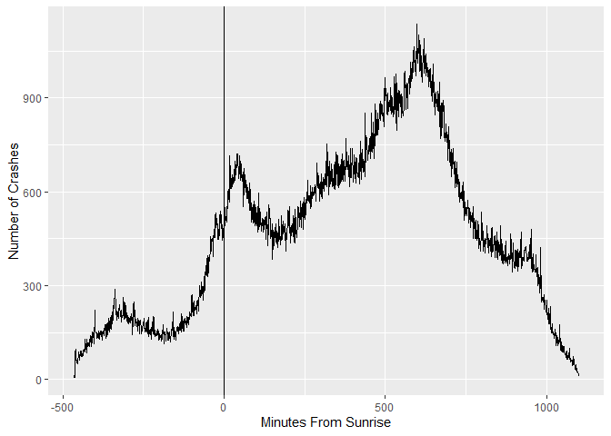
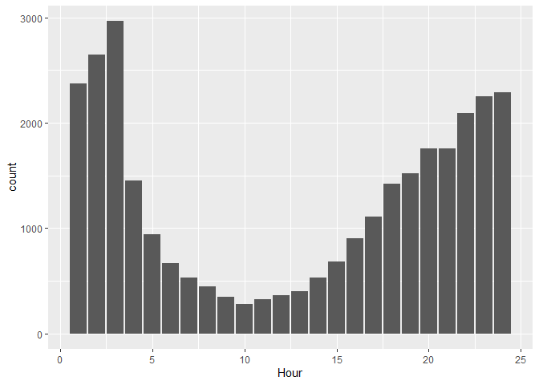
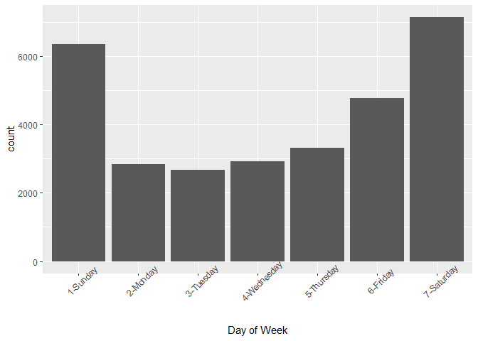
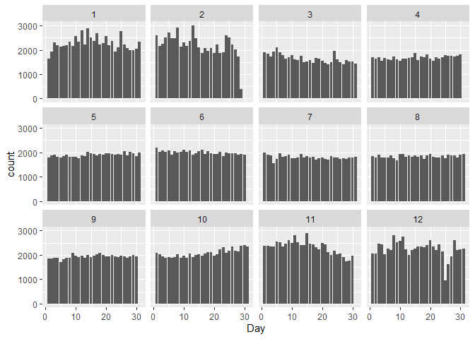
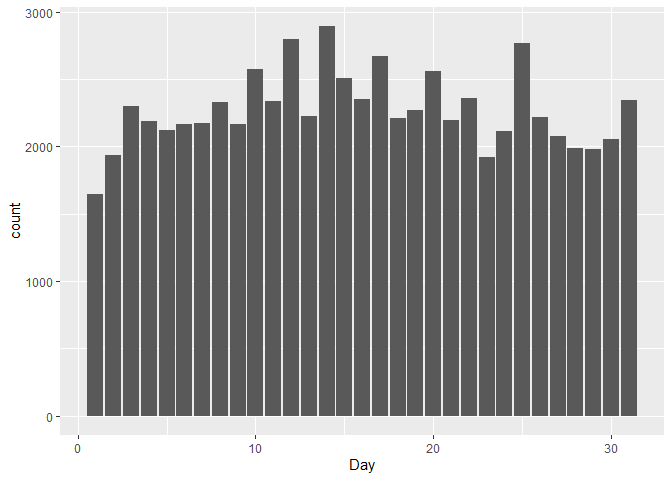

# Analysis of Vehicular Crashes in Iowa

##### Nathan Rethwisch and Zack Swayne

##### December 6, 2022

##### DS 202

## Introduction

According to the Iowa Department of Transportation, there are over
50,000 crashes per year1. These crashes cause millions in
property damage, and unfortunately, the loss of life, with over 300
people dying to vehicular crashes per year. It is important to gain a
greater understanding of the causes of these crashes in order to better
create prevention strategies and protect the drivers on the road.
Furthermore, by informing drivers of potential hazardous practices, they
will be better prepared and encouraged to follow safe driving practices.
The goal of this report is to explore some of the correlations between
crashes and driving conditions to gain a better understanding of how to
make the road a safer place.

## The Data

This data set comes from the Iowa Department of Transportation contains
data for every recorded vehicle crash since January 2009. It is updated
monthly by the Iowa Department of Transportation,

In total there are 728,442 observations in the data set and 37
variables, which included information on data and time of crash,
location, number of injuries or fatalities, weather and road conditions,
property damage, the number of passengers, and whether or not the driver
was under the influence.

Data cleaning included changing empty strings and illogical values into
NA values. Day, month, and year values were extracted using R’s
lubridate package. Latitude and longitude was columns were also created
from the ‘Position’ column to further explore where crashes happen in
Iowa.

## Sunrise/Sunset Analysis

After cleaning the data, our analysis focused on how time of the day
when car crashes happen. We hypothesize that more crashes will happen in
the morning and evening as the driver is travelling into the sun and has
to deal with sun glare, preventing them from seeing clearly.

### Data Extraction

Because evening and morning times are variable throughout the year, one
must look at when the sun is rising and setting. Because this data was
not included in the original data set, the data was scraped from
timeanddate.com2. The data includes sunrise and sunset times
for Ames, Iowa in 2020. The reasoning behind using Ames was that it is
the nearest major town to the geographical center of Iowa. This would
limit variation of sunrise and sunset times based on location. For
approximately every 70 miles, there is a one minute change in sunrise
and sunset times. By using Ames, these discrepancies to under three
minutes. The year 2020 was chosen because it is the most recent leap
year and would provide meaningful data for February 29.

The table that was used for the data collection is as follows:

Using a function, the data was extracted for each month in 2020 and
joined with the original crash data set.

### Sunrise/Sunset Analysis

The below graph shows the minutes from sunrise compared to number of
crashes, with a line denoting when the sunrise time is:

This clearly appears that there is a small spike, starting right before
the sun rises.

There also seems to be a noticeable spike around 750 minutes after
sunrise time. This likely corresponds to sunset time, so it is only
logical to look at how sunset time affects car crashes. The below graph
shows the minutes away from sunset, with a line denoting where the sun
sets.

There appears to be a pretty drastic jump right after the sun sets.
According to the Delaware Safety Council3, driving at dusk is
extremely dangerous, as one’s eyes take time to adjust to the relative
darkness, shadows hide animals and road features, and driver sometimes
fail to turn on their headlights. This may be a reason why there is such
a strong correlation between sunset time and a spike in car crashes.

### Daylight Analysis

One point of note is looking into how the length of the day affects car
crashes. The following graph shows the number of crashes based on the
length of the day. A line of best fit was added to the graph using LOESS
smoothing.

There seems to be more variability in earlier months, but overall a
downward trend.

There is very clearly a downward trend, showing that there is a
correlation to fewer daylight hours and more crashes.

### Conclusion:

A number of conclusions can be drawn from this data analysis. First, we
can conclude that there is a correlation between sunset and sunrise time
and frequency of crashes. The 30-minute window after the sun sets,
especially, is correlated with an increase in crashes in Iowa. There is
also a correlation between higher numbers of crashes and fewer daylight
hours, but this may be correlated with the winter months being more
dangerous for drivers. For future research, we would like to to further
look into how rush hour traffic may affect these trends.

## Alcohol Analysis

For my analysis, I would like to look into the relationship between
alcohol and car crashes. I especially want to look into how the severity
of car crashes and alcohol are related and what times are the most
dangerous in terms of drunk drivers.

The main data set has a variable titled “Drug or Alcohol” with eight
different levels. However, only two of these levels signify that
substances were not involved. Because of this I created a helper
variable titled “Drug\_Usage” that is TRUE when there are substances
involved and FALSE when there is none present.

In order to perform further calculations, I also created some helper
variables containing the total of crashes with and without alcohol,
respectively.

After that, I found the average property damage that results from
crashes with and without drunk driving. As I expected, drunk crashes do
cause more damage, almost $3000 more on average.

I also looked at the average fatalities per crash with and without
alcohol. The actual values of the averages aren’t super intuitive, as
they are small decimals, but finding the average rate of fatalities is
much more useful. When doing so, fatalities occur in sober crashes about
1 in 217 crashes, while fatalities in drunk crashes occur at about 1 in
20. This difference in fatality is expected, but I am shocked at how
much higher it truly is.

Next, I decided to look into how time of day affects drunk driving. I
plotted sober and drunk crashes and tried to find a pattern.

After that, I decided to try and find what percentage of crashes that
occur during late night hours involve alcohol. To do so, I created a
helper variable containing all crashes that occurred between 10 P.M. and
4 A.M.

The next unit of time I decided to look at was day of the week. I
expected to see a large spike on weekends, especially on Friday and
Saturday. To do so, I once again plotted both sober and drunk crashes by
day of the week and compared them.

Finally, I looked at crashes by day of the year. There is no real
pattern in by day of the year, but there are a few outliers. Both New
Year’s day and the Fourth of July have a very large amount of drunk
crashes in comparison to the rest of the year. This first graph shows
all drug-related crashes:

This graph shows all crashes in Iowa by day of year:

The fact that New Year’s day has triple the amount of drug-involved
crashes as any other day is particularly scary because January first has
the lowest amount of overall crashes in the month of January.

## Conclusion

1.  Alcohol drastically increases the danger and severity of crashes:
    fatalities, injuries, and property damage all occur at an increased
    rate.

2.  Nighttime and Friday and Saturday nights are the times with the most
    drunk driving, so it may be wise to avoid the roads at those times.

3.  The worst nights to drive on are New Year’s Eve and the Fourth of
    July, as they by far have the most drunk accidents of any other days
    in the year.

## Bibliography

1 “Iowa Motor Vehicle Crashes - 1925 to 2020” *Iowa Department of
Transportation,* 2022, <https://iowadot>.
gov/mvd/stats/crashhistory.pdf.

2 “Ames, Iowa, USA - sunrise, sunset, and daylength” *timeanddate*,
<https://www.timeanddate.com/> sun/@4846834?month=12&year=2020.

3 “Safe Driving Dusk and Dawn” *Delaware Safety Council,*
<https://delawaresafety.org/resources/>
Documents/Safety%20Documents/Safe%20Driving%20-%20%20Dusk%20and%20Dawn.pdf.
