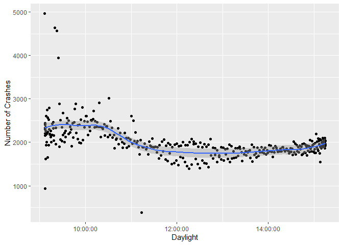
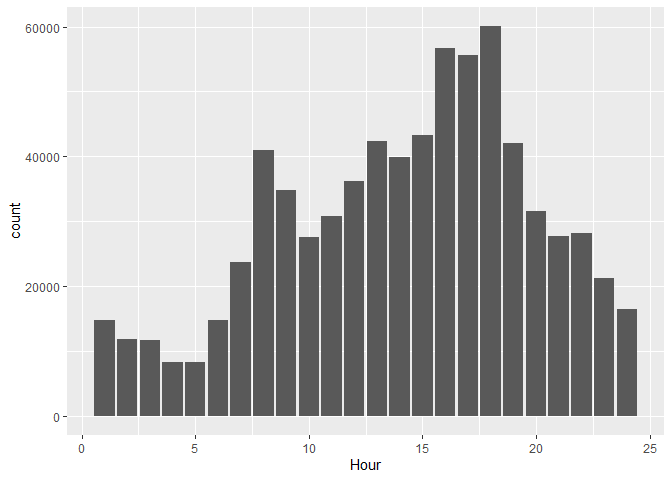
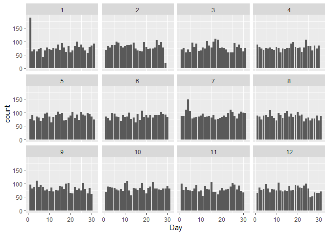

I love pufferfish

The goal of our project is to find what variables are most prominent
when causing crashes that are fatal, have significant crash severity, or
cause the most property damage. The variables we are looking at right
now include roadway type, roadway surface, environmental/weather
conditions, and light conditions. Eventually, we would like to create a
model to predict what conditions are most likely to cause serious
injuries.

Nathan:

In addition to this, I will be exploring the relationship accidents and
time of day. I want to see if certain things like driving into the sun
or driving at night result in a significant increase in accidents. I
hypothesize that crashes will increase when going eastbound during the
morning and decrease in the evening. For westbound drivers, the opposite
should be true- crashes will increase in the evening/afternoon and
decrease in the morning.

Zack:

I will be exploring the relationship between accidents as they are
related to alcohol or substance use and time of week. I want to see if
substance related accidents cause more property damage and/or injuries
and if substance related accidents are more likely to occur at night or
on the weekends. I hypothesize that alcohol based incidents will results
in more damage than normal accidents, and that alcohol and other
substance based accidents will happen more often at night and on the
weekends.

-We have not heard from Calvin

    library(tidyverse)

    ## ── Attaching packages ─────────────────────────────────────── tidyverse 1.3.2 ──
    ## ✔ ggplot2 3.3.6     ✔ purrr   0.3.4
    ## ✔ tibble  3.1.8     ✔ dplyr   1.0.9
    ## ✔ tidyr   1.2.0     ✔ stringr 1.4.1
    ## ✔ readr   2.1.2     ✔ forcats 0.5.2
    ## ── Conflicts ────────────────────────────────────────── tidyverse_conflicts() ──
    ## ✖ dplyr::filter() masks stats::filter()
    ## ✖ dplyr::lag()    masks stats::lag()

    #Use this if the below code doesn't work - file must be stored on your device.
    #crashes <- read.csv("../Vehicle_Crashes_in_Iowa.csv")
    crashes <- read_csv("https://media.githubusercontent.com/media/nathanrethwisch/Team-Pufferfish/main/Vehicle_Crashes_in_Iowa.csv")

    ## Rows: 728442 Columns: 37
    ## ── Column specification ────────────────────────────────────────────────────────
    ## Delimiter: ","
    ## chr  (26): Law Enforcement Case Number, Date of Crash, Month of Crash, Day o...
    ## dbl  (10): Iowa DOT Case Number, Number of Fatalities, Number of Injuries, N...
    ## time  (1): Time of Crash
    ## 
    ## ℹ Use `spec()` to retrieve the full column specification for this data.
    ## ℹ Specify the column types or set `show_col_types = FALSE` to quiet this message.

    dim(crashes)

    ## [1] 728442     37

    str(crashes)

    ## spec_tbl_df [728,442 × 37] (S3: spec_tbl_df/tbl_df/tbl/data.frame)
    ##  $ Iowa DOT Case Number           : num [1:728442] 2.01e+09 2.01e+09 2.01e+09 2.01e+09 2.01e+09 ...
    ##  $ Law Enforcement Case Number    : chr [1:728442] "0954" NA "09000001" "09000001" ...
    ##  $ Date of Crash                  : chr [1:728442] "01/01/2009" "01/01/2009" "01/01/2009" "01/01/2009" ...
    ##  $ Month of Crash                 : chr [1:728442] "01-January" "01-January" "01-January" "01-January" ...
    ##  $ Day of Week                    : chr [1:728442] "5-Thursday" "5-Thursday" "5-Thursday" "5-Thursday" ...
    ##  $ Time of Crash                  : 'hms' num [1:728442] 15:49:00 02:15:00 00:14:00 04:51:00 ...
    ##   ..- attr(*, "units")= chr "secs"
    ##  $ Hour                           : chr [1:728442] "Hour 16" "Hour 03" "Hour 01" "Hour 05" ...
    ##  $ DOT District                   : chr [1:728442] "District 6 (East Central)" "District 4 (Southwest)" "District 5 (Southeast)" "District 3 (Northwest)" ...
    ##  $ City Name                      : chr [1:728442] NA NA NA NA ...
    ##  $ County Name                    : chr [1:728442] NA NA NA NA ...
    ##  $ Route with System              : chr [1:728442] NA "IA 4" NA NA ...
    ##  $ Location Description           : chr [1:728442] "E DOVER CT" "IA 4/IOWA 4 & 170TH ST" "Co Rd J44/520TH ST" "Co Rd L36/D AVE" ...
    ##  $ First Harmful Event            : chr [1:728442] "Collision with:  Parked motor vehicle" "Collision with fixed object:  Other fixed object (explain in narrative)" "Collision with:  Animal" "Non-collision events:  Overturn/rollover" ...
    ##  $ Location of First Harmful Event: chr [1:728442] "On Roadway" "Shoulder" "On Roadway" "On Roadway" ...
    ##  $ Manner of Crash/Collision      : chr [1:728442] "Sideswipe, same direction" "Non-collision (single vehicle)" "Non-collision (single vehicle)" "Non-collision (single vehicle)" ...
    ##  $ Major Cause                    : chr [1:728442] "Lost Control" "Ran off road - right" "Animal" "Crossed centerline (undivided)" ...
    ##  $ Drug or Alcohol                : chr [1:728442] "None Indicated" "None Indicated" "None Indicated" "Alcohol (Statutory)" ...
    ##  $ Environmental Conditions       : chr [1:728442] "None apparent" "None apparent" "Animal in roadway" "None apparent" ...
    ##  $ Light Conditions               : chr [1:728442] "Daylight" "Dark - roadway not lighted" "Dark - roadway not lighted" "Dark - roadway not lighted" ...
    ##  $ Surface Conditions             : chr [1:728442] "Ice/frost" "Dry" "Dry" "Dry" ...
    ##  $ Weather Conditions             : chr [1:728442] "Cloudy" "Clear" "Clear" "Cloudy" ...
    ##  $ Roadway Contribution           : chr [1:728442] "None apparent" "None apparent" "None apparent" "None apparent" ...
    ##  $ Roadway Type                   : chr [1:728442] "Non-intersection:  Non-junction/no special feature" "Non-intersection:  Non-junction/no special feature" "Intersection:  Other intersection (explain in narrative)" "Non-intersection:  Non-junction/no special feature" ...
    ##  $ Roadway Surface                : chr [1:728442] "Paved" "Paved" "Unpaved" "Paved" ...
    ##  $ Work Zone                      : chr [1:728442] "N/A" "N/A" "N/A" "N/A" ...
    ##  $ Crash Severity                 : chr [1:728442] "Property Damage Only" "Property Damage Only" "Minor Injury" "Property Damage Only" ...
    ##  $ Number of Fatalities           : num [1:728442] 0 0 0 0 0 0 0 0 0 0 ...
    ##  $ Number of Injuries             : num [1:728442] 0 0 2 0 0 0 1 0 1 1 ...
    ##  $ Number of Major Injuries       : num [1:728442] 0 0 0 0 0 0 0 0 0 0 ...
    ##  $ Number of Minor Injuries       : num [1:728442] 0 0 1 0 0 0 0 0 0 1 ...
    ##  $ Number of Possible Injuries    : num [1:728442] 0 0 1 0 0 0 1 0 1 0 ...
    ##  $ Number of Unknown Injuries     : num [1:728442] 0 0 0 0 0 0 0 0 0 0 ...
    ##  $ Amount of Property Damage      : num [1:728442] 2000 5750 8000 2000 1000 ...
    ##  $ Number of Vehicles Involved    : num [1:728442] 2 1 1 1 1 2 1 2 2 2 ...
    ##  $ Total Number of Occupants      : num [1:728442] 1 1 2 1 1 2 2 4 2 3 ...
    ##  $ Travel Direction               : chr [1:728442] "N/A" "N/A" "N/A" "N/A" ...
    ##  $ Location                       : chr [1:728442] "POINT (-90.567730450144 41.54429908431)" "POINT (-94.367629082433 41.76148937584)" "POINT (-92.944073472578 40.725020835225)" "POINT (-95.799893234639 42.801520512692)" ...
    ##  - attr(*, "spec")=
    ##   .. cols(
    ##   ..   `Iowa DOT Case Number` = col_double(),
    ##   ..   `Law Enforcement Case Number` = col_character(),
    ##   ..   `Date of Crash` = col_character(),
    ##   ..   `Month of Crash` = col_character(),
    ##   ..   `Day of Week` = col_character(),
    ##   ..   `Time of Crash` = col_time(format = ""),
    ##   ..   Hour = col_character(),
    ##   ..   `DOT District` = col_character(),
    ##   ..   `City Name` = col_character(),
    ##   ..   `County Name` = col_character(),
    ##   ..   `Route with System` = col_character(),
    ##   ..   `Location Description` = col_character(),
    ##   ..   `First Harmful Event` = col_character(),
    ##   ..   `Location of First Harmful Event` = col_character(),
    ##   ..   `Manner of Crash/Collision` = col_character(),
    ##   ..   `Major Cause` = col_character(),
    ##   ..   `Drug or Alcohol` = col_character(),
    ##   ..   `Environmental Conditions` = col_character(),
    ##   ..   `Light Conditions` = col_character(),
    ##   ..   `Surface Conditions` = col_character(),
    ##   ..   `Weather Conditions` = col_character(),
    ##   ..   `Roadway Contribution` = col_character(),
    ##   ..   `Roadway Type` = col_character(),
    ##   ..   `Roadway Surface` = col_character(),
    ##   ..   `Work Zone` = col_character(),
    ##   ..   `Crash Severity` = col_character(),
    ##   ..   `Number of Fatalities` = col_double(),
    ##   ..   `Number of Injuries` = col_double(),
    ##   ..   `Number of Major Injuries` = col_double(),
    ##   ..   `Number of Minor Injuries` = col_double(),
    ##   ..   `Number of Possible Injuries` = col_double(),
    ##   ..   `Number of Unknown Injuries` = col_double(),
    ##   ..   `Amount of Property Damage` = col_double(),
    ##   ..   `Number of Vehicles Involved` = col_double(),
    ##   ..   `Total Number of Occupants` = col_double(),
    ##   ..   `Travel Direction` = col_character(),
    ##   ..   Location = col_character()
    ##   .. )
    ##  - attr(*, "problems")=<externalptr>

    #NA values are only found in a few values?
    colSums(is.na(crashes))

    ##            Iowa DOT Case Number     Law Enforcement Case Number 
    ##                               0                           45587 
    ##                   Date of Crash                  Month of Crash 
    ##                               0                               0 
    ##                     Day of Week                   Time of Crash 
    ##                               0                               0 
    ##                            Hour                    DOT District 
    ##                               0                               0 
    ##                       City Name                     County Name 
    ##                          279583                          109894 
    ##               Route with System            Location Description 
    ##                          451161                           50640 
    ##             First Harmful Event Location of First Harmful Event 
    ##                               0                               0 
    ##       Manner of Crash/Collision                     Major Cause 
    ##                               0                               0 
    ##                 Drug or Alcohol        Environmental Conditions 
    ##                               0                               0 
    ##                Light Conditions              Surface Conditions 
    ##                               0                               0 
    ##              Weather Conditions            Roadway Contribution 
    ##                               0                               0 
    ##                    Roadway Type                 Roadway Surface 
    ##                               0                               0 
    ##                       Work Zone                  Crash Severity 
    ##                               0                               0 
    ##            Number of Fatalities              Number of Injuries 
    ##                               0                               0 
    ##        Number of Major Injuries        Number of Minor Injuries 
    ##                               0                               0 
    ##     Number of Possible Injuries      Number of Unknown Injuries 
    ##                               0                               0 
    ##       Amount of Property Damage     Number of Vehicles Involved 
    ##                               9                               0 
    ##       Total Number of Occupants                Travel Direction 
    ##                               0                               0 
    ##                        Location 
    ##                               1

    #This is strange because it appears that Weather Conditions has NA values
    sum(is.na(crashes$`Weather Conditions`))

    ## [1] 0

    #Making blank and N/A value in NA
    crashes$`City Name`[crashes$`City Name` == ""] <- NA
    crashes$`County Name`[crashes$`County Name` == ""] <- NA
    crashes$`Route with System`[crashes$`Route with System` == ""] <- NA
    crashes[crashes=="N/A"]<-NA
    crashes$`Total Number of Occupants`[crashes$`Total Number of Occupants` == 777] <- NA

    #Making the case number an integer
    crashes$`Law Enforcement Case Number` <- as.integer(crashes$`Law Enforcement Case Number`)

    ## Warning: NAs introduced by coercion

    ## Warning: NAs introduced by coercion to integer range

    #Checking NA sums after we made changes to the dataset
    colSums(is.na(crashes))

    ##            Iowa DOT Case Number     Law Enforcement Case Number 
    ##                               0                          527840 
    ##                   Date of Crash                  Month of Crash 
    ##                               0                               0 
    ##                     Day of Week                   Time of Crash 
    ##                               0                               0 
    ##                            Hour                    DOT District 
    ##                               0                               4 
    ##                       City Name                     County Name 
    ##                          279583                          109894 
    ##               Route with System            Location Description 
    ##                          451161                           50640 
    ##             First Harmful Event Location of First Harmful Event 
    ##                            2311                           23872 
    ##       Manner of Crash/Collision                     Major Cause 
    ##                           51205                               0 
    ##                 Drug or Alcohol        Environmental Conditions 
    ##                               0                           63550 
    ##                Light Conditions              Surface Conditions 
    ##                           71992                           72352 
    ##              Weather Conditions            Roadway Contribution 
    ##                           72784                           79089 
    ##                    Roadway Type                 Roadway Surface 
    ##                           68521                           50634 
    ##                       Work Zone                  Crash Severity 
    ##                          719474                               0 
    ##            Number of Fatalities              Number of Injuries 
    ##                               0                               0 
    ##        Number of Major Injuries        Number of Minor Injuries 
    ##                               0                               0 
    ##     Number of Possible Injuries      Number of Unknown Injuries 
    ##                               0                               0 
    ##       Amount of Property Damage     Number of Vehicles Involved 
    ##                               9                               0 
    ##       Total Number of Occupants                Travel Direction 
    ##                           12325                          491785 
    ##                        Location 
    ##                               1

    #Getting the distinct latitude and longitude
    crashes<- crashes%>%
      separate(col = Location, into = c(NA, "Latitude", "Longitude"), remove =
                 FALSE, sep = " ")

    crashes<- crashes%>%mutate(Latitude = parse_number(Latitude), Longitude = parse_number(Longitude))

    crashes$`Date of Crash` <- lubridate::mdy(crashes$`Date of Crash`)

    #Creating a new columns that are separate for year, month, and day
    crashes <- crashes%>%
      separate(col = `Date of Crash`, into = c("Year", "Month", "Day"), remove =
                 FALSE, sep = "-")
    #View(crashes)

    #Looking at the different crash severities
    crashes%>%
      group_by(`Crash Severity`)%>%
      summarise(n = n())

    ## # A tibble: 5 × 2
    ##   `Crash Severity`          n
    ##   <chr>                 <int>
    ## 1 Fatal                  4323
    ## 2 Major Injury          16810
    ## 3 Minor Injury          65801
    ## 4 Possible/Unknown     115784
    ## 5 Property Damage Only 525724

    #Roadway contribution to fatal car accidents
    crashes%>%
      filter(`Crash Severity` == "Fatal")%>%
      group_by(`Roadway Contribution`)%>%
      summarise(n = n())

    ## # A tibble: 16 × 2
    ##    `Roadway Contribution`                           n
    ##    <chr>                                        <int>
    ##  1 Debris                                           8
    ##  2 Disabled vehicle                                12
    ##  3 Non-highway work                                 2
    ##  4 None apparent                                 3774
    ##  5 Obstruction in roadway                           3
    ##  6 Other (explain in narrative)                    24
    ##  7 Ruts/holes/bumps                                14
    ##  8 Shoulders (none, low, soft, high)               15
    ##  9 Slippery, loose, or worn surface                11
    ## 10 Surface condition (e.g., wet, icy)             306
    ## 11 Traffic backup, prior crash                      5
    ## 12 Traffic backup, prior non-recurring incident     3
    ## 13 Traffic backup, regular congestion               1
    ## 14 Unknown                                         56
    ## 15 Work Zone (roadway-related)                     84
    ## 16 <NA>                                             5

    #The count of roadway contributions by injury severity
    crashes%>%
      ggplot(aes(x = `Roadway Contribution`)) +geom_bar() + facet_wrap(~`Crash Severity`)+coord_flip()

    #Map of all crashes in Iowa
    crashes%>%
          ggplot(aes(x = Latitude, y = Longitude)) + geom_point()

    ## Warning: Removed 1 rows containing missing values (geom_point).

    #Crash severity grouped by roadway type
    crashes2<- crashes%>%
      group_by(`Roadway Type`, `Crash Severity`)%>%
      summarise(n = n())

    ## `summarise()` has grouped output by 'Roadway Type'. You can override using the
    ## `.groups` argument.

    crashes2[which.max(crashes2$n),]

    ## # A tibble: 1 × 3
    ## # Groups:   Roadway Type [1]
    ##   `Roadway Type`                                     `Crash Severity`          n
    ##   <chr>                                              <chr>                 <int>
    ## 1 Non-intersection:  Non-junction/no special feature Property Damage Only 243391

    #The top cause of fatal crashes
    crashes3<- crashes%>%
      filter(`Crash Severity` == "Fatal")%>%
      group_by(`Major Cause`)%>%
      summarise(n = n())

    crashes3[which.max(crashes3$n),]

    ## # A tibble: 1 × 2
    ##   `Major Cause`            n
    ##   <chr>                <int>
    ## 1 Ran off road - right   708

    #Looking at the top environmental and surface conditions for fatal accidents
    Cause_crashes<- crashes%>%
      filter(`Crash Severity` == "Fatal")%>%
      group_by(`Environmental Conditions`, `Light Conditions`, `Surface Conditions`, `Weather Conditions`)%>%
      summarise(n = n())

    ## `summarise()` has grouped output by 'Environmental Conditions', 'Light
    ## Conditions', 'Surface Conditions'. You can override using the `.groups`
    ## argument.

    Cause_crashes%>%filter(n > 100)

    ## # A tibble: 5 × 5
    ## # Groups:   Environmental Conditions, Light Conditions, Surface Conditions [3]
    ##   `Environmental Conditions` `Light Conditions`         Surface …¹ Weath…²     n
    ##   <chr>                      <chr>                      <chr>      <chr>   <int>
    ## 1 None apparent              Dark - roadway lighted     Dry        Clear     246
    ## 2 None apparent              Dark - roadway not lighted Dry        Clear     623
    ## 3 None apparent              Dark - roadway not lighted Dry        Cloudy    175
    ## 4 None apparent              Daylight                   Dry        Clear    1285
    ## 5 None apparent              Daylight                   Dry        Cloudy    463
    ## # … with abbreviated variable names ¹​`Surface Conditions`,
    ## #   ²​`Weather Conditions`

    #Barplot of fatal crashes by light condition
    crashes%>%
      filter(`Crash Severity` == "Fatal")%>%
      ggplot(aes(x = `Light Conditions`)) +geom_bar() + coord_flip()

    #Fatal Crashes by Day
    crashes%>%
      group_by(Month)%>%
      filter(`Crash Severity` == "Fatal")%>%
      ggplot(aes(x = Day, fill = `Crash Severity`)) +geom_bar() + facet_wrap(~Month) + coord_flip()

    #All types of crashes by month
    crashes%>%
      group_by(Month)%>%
      ggplot(aes(x = Day, fill = `Crash Severity`)) +geom_bar() + facet_wrap(~Month)

    crashes%>%
      filter(`Amount of Property Damage`<100000)%>%
      ggplot(aes(x = `Amount of Property Damage`, y = `Number of Injuries`)) + geom_point()

    crashes%>%
      filter(`Amount of Property Damage`<100000)%>%
      ggplot(aes(x = `Amount of Property Damage`, y = `Number of Minor Injuries`)) + geom_point()

    crashes%>%
      filter(`Amount of Property Damage`<100000)%>%
      ggplot(aes(x = `Amount of Property Damage`, y = `Number of Major Injuries`)) + geom_point()

    #Crashes by direction
    crashes$Hour<- gsub("Hour ", "\\1", crashes$Hour)
    crashes$Hour<- parse_integer(crashes$Hour)
    #View(crashes)

    crashes<- crashes %>% mutate(TimesOfDay =
                         case_when((Hour >20) | (Hour <=5) ~"Night",
                                   (Hour >5) & (Hour <=11) ~"Morning",
                                   (Hour >=12) & (Hour <18) ~"Afternoon",
                                   (Hour >=18) & (Hour <21) ~"Evening")
    )
    #View(crashes)

    crashes%>%
      filter(!is.na(`Travel Direction`), `Travel Direction` %in% c('Westbound (WB)', 'Eastbound (EB)'))%>%
      ggplot(aes(x = `Travel Direction`, fill = `TimesOfDay`)) + geom_bar() + coord_flip()

    #Fatal crashes per month by time of day
    crashes%>%
      filter(!is.na(`Travel Direction`), `Travel Direction` %in% c('Westbound (WB)', 'Eastbound (EB)'), `Crash Severity` == "Fatal")%>%
      ggplot(aes(x = `Travel Direction`, fill = `TimesOfDay`)) + geom_bar() + coord_flip() + facet_wrap(~Month)

    crashes%>%
      filter(`Month` == "08", `Crash Severity` == "Fatal", `Travel Direction` == "Eastbound (EB)")%>%
      group_by(Day)%>%
      summarise(n = n())

    ## # A tibble: 22 × 2
    ##    Day       n
    ##    <chr> <int>
    ##  1 01        1
    ##  2 02        1
    ##  3 03        1
    ##  4 04        2
    ##  5 05        2
    ##  6 06        2
    ##  7 08        1
    ##  8 09        1
    ##  9 10        4
    ## 10 11        2
    ## # … with 12 more rows

    crashes%>%
      filter(`Month` == "06", `Crash Severity` == "Fatal", `Travel Direction` == "Westbound (WB)")%>%
      group_by(Day)%>%
      summarise(n = n())

    ## # A tibble: 22 × 2
    ##    Day       n
    ##    <chr> <int>
    ##  1 01        2
    ##  2 02        2
    ##  3 03        1
    ##  4 04        3
    ##  5 05        1
    ##  6 06        1
    ##  7 07        2
    ##  8 08        2
    ##  9 09        3
    ## 10 10        1
    ## # … with 12 more rows

    #All crashes by month and time of day and direction of travel
    crashes%>%
      filter(!is.na(`Travel Direction`), `Travel Direction` %in% c('Westbound (WB)', 'Eastbound (EB)'))%>%
      ggplot(aes(x = `Travel Direction`, fill = `TimesOfDay`)) + geom_bar() + coord_flip() + facet_wrap(~Month)

    crashes%>%
      ggplot(aes(x = `Hour`)) + geom_bar() + facet_wrap(~Month)

\# if (any(final\_weather == “Note: hours shift because clocks change
forward 1 hour. (See the note below this table for details)”)){

\# final\_weather &lt;-final\_weather\[-which(final\_weather$Sunrise ==
“Note: hours shift because clocks change forward 1 hour. (See the note
below this table for details)”),\]

\# } else if (any(final\_weather == “Note: hours shift because clocks
change backward 1 hour. (See the note below this table for details)”)){

\# final\_weather &lt;- final\_weather\[-which(final\_weather$Sunrise ==
“Note: hours shift because clocks change backward 1 hour. (See the note
below this table for details)”)\]

\# }

    #install.packages("rvest")
    library(rvest)

    ## 
    ## Attaching package: 'rvest'

    ## The following object is masked from 'package:readr':
    ## 
    ##     guess_encoding

    library(dplyr)
    page <- read_html("https://www.timeanddate.com/sun/@4846834?month=3&year=2020")
    tables <- page %>% html_table(fill = TRUE)
    tables %>% str

    ## List of 2
    ##  $ : tibble [7 × 2] (S3: tbl_df/tbl/data.frame)
    ##   ..$ X1: chr [1:7] "Current Time:" "Sun Direction:" "Sun Altitude:" "Sun Distance:" ...
    ##   ..$ X2: chr [1:7] "Nov 15, 2022 at 10:43:29 pm" "↑ 320° Northwest" "-61.7°" "91.936 million mi" ...
    ##  $ : tibble [34 × 26] (S3: tbl_df/tbl/data.frame)
    ##   ..$ 2020                 : chr [1:34] "Mar" "Mar" "2" "3" ...
    ##   ..$ Sunrise/Sunset       : chr [1:34] "Sunrise" "Sunrise" "6:47 am ↑ (99°)" "6:45 am ↑ (98°)" ...
    ##   ..$ Sunrise/Sunset       : chr [1:34] "Sunset" "Sunset" "6:06 pm ↑ (262°)" "6:07 pm ↑ (262°)" ...
    ##   ..$ Daylength            : chr [1:34] "Length" "Length" "11:19:29" "11:22:18" ...
    ##   ..$ Daylength            : chr [1:34] "Diff." "Diff." "+2:48" "+2:48" ...
    ##   ..$ Astronomical Twilight: chr [1:34] "Start" "Start" "5:14 am" "5:12 am" ...
    ##   ..$ Astronomical Twilight: chr [1:34] "End" "End" "7:39 pm" "7:40 pm" ...
    ##   ..$ Nautical Twilight    : chr [1:34] "Start" "Start" "5:46 am" "5:45 am" ...
    ##   ..$ Nautical Twilight    : chr [1:34] "End" "End" "7:06 pm" "7:08 pm" ...
    ##   ..$ Civil Twilight       : chr [1:34] "Start" "Start" "6:19 am" "6:17 am" ...
    ##   ..$ Civil Twilight       : chr [1:34] "End" "End" "6:34 pm" "6:35 pm" ...
    ##   ..$ Solar Noon           : chr [1:34] "Time" "Time" "12:26 pm (41.2°)" "12:26 pm (41.6°)" ...
    ##   ..$ Solar Noon           : chr [1:34] "Mil. mi" "Mil. mi" "92.144" "92.166" ...
    ##   ..$                      : int [1:34] NA 1 NA NA NA NA NA NA NA NA ...
    ##   ..$                      : chr [1:34] NA "6:48 am ↑ (99°)" NA NA ...
    ##   ..$                      : chr [1:34] NA "6:05 pm ↑ (261°)" NA NA ...
    ##   ..$                      : chr [1:34] NA "11:16:41" NA NA ...
    ##   ..$                      : chr [1:34] NA "+2:47" NA NA ...
    ##   ..$                      : chr [1:34] NA "5:16 am" NA NA ...
    ##   ..$                      : chr [1:34] NA "7:38 pm" NA NA ...
    ##   ..$                      : chr [1:34] NA "5:48 am" NA NA ...
    ##   ..$                      : chr [1:34] NA "7:05 pm" NA NA ...
    ##   ..$                      : chr [1:34] NA "6:20 am" NA NA ...
    ##   ..$                      : chr [1:34] NA "6:33 pm" NA NA ...
    ##   ..$                      : chr [1:34] NA "12:26 pm (40.8°)" NA NA ...
    ##   ..$                      : num [1:34] NA 92.1 NA NA NA ...

    weather<- tables[[2]]

    names(weather)[1] <- "Date"
    names(weather)[2] <- "Sunrise"
    names(weather)[3] <- "Sunset"
    #View(weather)
    weather2 <-weather[14:16]
    #View(weather)
    names(weather2)[1] <- "Date"
    names(weather2)[2] <- "Sunrise"
    names(weather2)[3] <- "Sunset"
    #View(weather)

    weather2$Date <- as.character(weather2$Date)
    weather <- weather[1:3]

    final_weather <- full_join(na.omit(weather), na.omit(weather2))

    ## Joining, by = c("Date", "Sunrise", "Sunset")

    final_weather[1,]<- final_weather[nrow(final_weather),]
    final_weather <- final_weather[-2,]
    final_weather <- final_weather[-nrow(final_weather)+1: -nrow(final_weather),]

    if (any(final_weather == "Note: hours shift because clocks change forward 1 hour. (See the note below this table for details)")){
      final_weather <-final_weather[-which(final_weather$Sunrise ==  "Note: hours shift because clocks change forward 1 hour. (See the note below this table for details)"),]
    } else if (any(final_weather == "Note: hours shift because clocks change backward 1 hour. (See the note below this table for details)")){
      final_weather <- final_weather[-which(final_weather$Sunrise == "Note: hours shift because clocks change backward 1 hour. (See the note below this table for details)"),]
    }

    View(final_weather)

    #Ones that are debatable
    #final_weather$Month <- 3

    library(rvest)
    library(dplyr)
    library(hms)
    dfmonth <- function(url, number) {
    page <- read_html(url)
    tables <- page %>% html_table(fill = TRUE)
    tables %>% str
    weather<- tables[[2]]

    names(weather)[1] <- "Date"
    names(weather)[2] <- "Sunrise"
    names(weather)[3] <- "Sunset"
    #View(weather)
    weather2 <-weather[14:16]
    #View(weather)
    names(weather2)[1] <- "Date"
    names(weather2)[2] <- "Sunrise"
    names(weather2)[3] <- "Sunset"
    #View(weather)

    weather2$Date <- as.character(weather2$Date)
    weather <- weather[1:3]

    final_weather <- full_join(na.omit(weather), na.omit(weather2))
    final_weather[1,]<- final_weather[nrow(final_weather),]
    final_weather <- final_weather[-2,]
    final_weather <- final_weather[-nrow(final_weather)+1: -nrow(final_weather),]

    if (any(final_weather == "Note: hours shift because clocks change forward 1 hour. (See the note below this table for details)")){
      final_weather <-final_weather[-which(final_weather$Sunrise ==  "Note: hours shift because clocks change forward 1 hour. (See the note below this table for details)"),]
    } else if (any(final_weather == "Note: hours shift because clocks change backward 1 hour. (See the note below this table for details)")){
      final_weather <- final_weather[-which(final_weather$Sunrise == "Note: hours shift because clocks change backward 1 hour. (See the note below this table for details)"),]
    }

    final_weather$Month <- number
      
    final_weather<-final_weather%>%
      separate(col = Sunrise, into = c("Sunrise Time", NA), remove = TRUE, sep = " ↑")

    final_weather<-final_weather%>%
      separate(col = Sunset, into = c("Sunset Time", NA), remove = TRUE, sep = " ↑")

    final_weather$`Sunset Time` <- format(strptime(final_weather$`Sunset Time`, "%I:%M %p"), format="%H:%M:%S")

    final_weather$`Sunrise Time` <- format(strptime(final_weather$`Sunrise Time`, "%I:%M %p"), format="%H:%M:%S")

    final_weather$`Sunrise Time` <- as_hms(final_weather$`Sunrise Time`)
    final_weather$`Sunset Time` <- as_hms(final_weather$`Sunset Time`)

      return (final_weather)
    }

    sun<- dfmonth("https://www.timeanddate.com/sun/@4846834?month=1&year=2020", 1)

    ## List of 2
    ##  $ : tibble [7 × 2] (S3: tbl_df/tbl/data.frame)
    ##   ..$ X1: chr [1:7] "Current Time:" "Sun Direction:" "Sun Altitude:" "Sun Distance:" ...
    ##   ..$ X2: chr [1:7] "Nov 15, 2022 at 10:43:29 pm" "↑ 320° Northwest" "-61.7°" "91.936 million mi" ...
    ##  $ : tibble [33 × 26] (S3: tbl_df/tbl/data.frame)
    ##   ..$ 2020                 : chr [1:33] "Jan" "Jan" "2" "3" ...
    ##   ..$ Sunrise/Sunset       : chr [1:33] "Sunrise" "Sunrise" "7:42 am ↑ (121°)" "7:42 am ↑ (121°)" ...
    ##   ..$ Sunrise/Sunset       : chr [1:33] "Sunset" "Sunset" "4:54 pm ↑ (239°)" "4:55 pm ↑ (239°)" ...
    ##   ..$ Daylength            : chr [1:33] "Length" "Length" "9:11:30" "9:12:21" ...
    ##   ..$ Daylength            : chr [1:33] "Diff." "Diff." "+0:46" "+0:50" ...
    ##   ..$ Astronomical Twilight: chr [1:33] "Start" "Start" "6:02 am" "6:02 am" ...
    ##   ..$ Astronomical Twilight: chr [1:33] "End" "End" "6:34 pm" "6:35 pm" ...
    ##   ..$ Nautical Twilight    : chr [1:33] "Start" "Start" "6:36 am" "6:36 am" ...
    ##   ..$ Nautical Twilight    : chr [1:33] "End" "End" "6:00 pm" "6:01 pm" ...
    ##   ..$ Civil Twilight       : chr [1:33] "Start" "Start" "7:11 am" "7:11 am" ...
    ##   ..$ Civil Twilight       : chr [1:33] "End" "End" "5:25 pm" "5:26 pm" ...
    ##   ..$ Solar Noon           : chr [1:33] "Time" "Time" "12:18 pm (25.1°)" "12:18 pm (25.2°)" ...
    ##   ..$ Solar Noon           : chr [1:33] "Mil. mi" "Mil. mi" "91.400" "91.399" ...
    ##   ..$                      : int [1:33] NA 1 NA NA NA NA NA NA NA NA ...
    ##   ..$                      : chr [1:33] NA "7:42 am ↑ (121°)" NA NA ...
    ##   ..$                      : chr [1:33] NA "4:53 pm ↑ (239°)" NA NA ...
    ##   ..$                      : chr [1:33] NA "9:10:43" NA NA ...
    ##   ..$                      : chr [1:33] NA "+0:42" NA NA ...
    ##   ..$                      : chr [1:33] NA "6:01 am" NA NA ...
    ##   ..$                      : chr [1:33] NA "6:34 pm" NA NA ...
    ##   ..$                      : chr [1:33] NA "6:35 am" NA NA ...
    ##   ..$                      : chr [1:33] NA "6:00 pm" NA NA ...
    ##   ..$                      : chr [1:33] NA "7:11 am" NA NA ...
    ##   ..$                      : chr [1:33] NA "5:24 pm" NA NA ...
    ##   ..$                      : chr [1:33] NA "12:17 pm (25.0°)" NA NA ...
    ##   ..$                      : num [1:33] NA 91.4 NA NA NA ...

    ## Joining, by = c("Date", "Sunrise", "Sunset")

    for (i in 2:12){
      url<- paste0("https://www.timeanddate.com/sun/@4846834?month=", i, "&year=2020")
      dfTemp<- dfmonth(url, i)
      sun<- full_join(sun, dfTemp)
      
    }

    ## List of 2
    ##  $ : tibble [7 × 2] (S3: tbl_df/tbl/data.frame)
    ##   ..$ X1: chr [1:7] "Current Time:" "Sun Direction:" "Sun Altitude:" "Sun Distance:" ...
    ##   ..$ X2: chr [1:7] "Nov 15, 2022 at 10:43:29 pm" "↑ 320° Northwest" "-61.7°" "91.936 million mi" ...
    ##  $ : tibble [31 × 26] (S3: tbl_df/tbl/data.frame)
    ##   ..$ 2020                 : chr [1:31] "Feb" "Feb" "2" "3" ...
    ##   ..$ Sunrise/Sunset       : chr [1:31] "Sunrise" "Sunrise" "7:26 am ↑ (112°)" "7:25 am ↑ (112°)" ...
    ##   ..$ Sunrise/Sunset       : chr [1:31] "Sunset" "Sunset" "5:30 pm ↑ (248°)" "5:31 pm ↑ (248°)" ...
    ##   ..$ Daylength            : chr [1:31] "Length" "Length" "10:03:22" "10:05:43" ...
    ##   ..$ Daylength            : chr [1:31] "Diff." "Diff." "+2:19" "+2:20" ...
    ##   ..$ Astronomical Twilight: chr [1:31] "Start" "Start" "5:51 am" "5:50 am" ...
    ##   ..$ Astronomical Twilight: chr [1:31] "End" "End" "7:05 pm" "7:06 pm" ...
    ##   ..$ Nautical Twilight    : chr [1:31] "Start" "Start" "6:23 am" "6:22 am" ...
    ##   ..$ Nautical Twilight    : chr [1:31] "End" "End" "6:33 pm" "6:34 pm" ...
    ##   ..$ Civil Twilight       : chr [1:31] "Start" "Start" "6:57 am" "6:56 am" ...
    ##   ..$ Civil Twilight       : chr [1:31] "End" "End" "5:59 pm" "6:00 pm" ...
    ##   ..$ Solar Noon           : chr [1:31] "Time" "Time" "12:28 pm (31.2°)" "12:28 pm (31.5°)" ...
    ##   ..$ Solar Noon           : chr [1:31] "Mil. mi" "Mil. mi" "91.602" "91.615" ...
    ##   ..$                      : int [1:31] NA 1 NA NA NA NA NA NA NA NA ...
    ##   ..$                      : chr [1:31] NA "7:27 am ↑ (113°)" NA NA ...
    ##   ..$                      : chr [1:31] NA "5:28 pm ↑ (248°)" NA NA ...
    ##   ..$                      : chr [1:31] NA "10:01:03" NA NA ...
    ##   ..$                      : chr [1:31] NA "+2:17" NA NA ...
    ##   ..$                      : chr [1:31] NA "5:51 am" NA NA ...
    ##   ..$                      : chr [1:31] NA "7:04 pm" NA NA ...
    ##   ..$                      : chr [1:31] NA "6:24 am" NA NA ...
    ##   ..$                      : chr [1:31] NA "6:31 pm" NA NA ...
    ##   ..$                      : chr [1:31] NA "6:58 am" NA NA ...
    ##   ..$                      : chr [1:31] NA "5:58 pm" NA NA ...
    ##   ..$                      : chr [1:31] NA "12:28 pm (30.9°)" NA NA ...
    ##   ..$                      : num [1:31] NA 91.6 NA NA NA ...

    ## Joining, by = c("Date", "Sunrise", "Sunset")
    ## Joining, by = c("Date", "Sunrise Time", "Sunset Time", "Month")

    ## List of 2
    ##  $ : tibble [7 × 2] (S3: tbl_df/tbl/data.frame)
    ##   ..$ X1: chr [1:7] "Current Time:" "Sun Direction:" "Sun Altitude:" "Sun Distance:" ...
    ##   ..$ X2: chr [1:7] "Nov 15, 2022 at 10:43:30 pm" "↑ 320° Northwest" "-61.7°" "91.936 million mi" ...
    ##  $ : tibble [34 × 26] (S3: tbl_df/tbl/data.frame)
    ##   ..$ 2020                 : chr [1:34] "Mar" "Mar" "2" "3" ...
    ##   ..$ Sunrise/Sunset       : chr [1:34] "Sunrise" "Sunrise" "6:47 am ↑ (99°)" "6:45 am ↑ (98°)" ...
    ##   ..$ Sunrise/Sunset       : chr [1:34] "Sunset" "Sunset" "6:06 pm ↑ (262°)" "6:07 pm ↑ (262°)" ...
    ##   ..$ Daylength            : chr [1:34] "Length" "Length" "11:19:29" "11:22:18" ...
    ##   ..$ Daylength            : chr [1:34] "Diff." "Diff." "+2:48" "+2:48" ...
    ##   ..$ Astronomical Twilight: chr [1:34] "Start" "Start" "5:14 am" "5:12 am" ...
    ##   ..$ Astronomical Twilight: chr [1:34] "End" "End" "7:39 pm" "7:40 pm" ...
    ##   ..$ Nautical Twilight    : chr [1:34] "Start" "Start" "5:46 am" "5:45 am" ...
    ##   ..$ Nautical Twilight    : chr [1:34] "End" "End" "7:06 pm" "7:08 pm" ...
    ##   ..$ Civil Twilight       : chr [1:34] "Start" "Start" "6:19 am" "6:17 am" ...
    ##   ..$ Civil Twilight       : chr [1:34] "End" "End" "6:34 pm" "6:35 pm" ...
    ##   ..$ Solar Noon           : chr [1:34] "Time" "Time" "12:26 pm (41.2°)" "12:26 pm (41.6°)" ...
    ##   ..$ Solar Noon           : chr [1:34] "Mil. mi" "Mil. mi" "92.144" "92.166" ...
    ##   ..$                      : int [1:34] NA 1 NA NA NA NA NA NA NA NA ...
    ##   ..$                      : chr [1:34] NA "6:48 am ↑ (99°)" NA NA ...
    ##   ..$                      : chr [1:34] NA "6:05 pm ↑ (261°)" NA NA ...
    ##   ..$                      : chr [1:34] NA "11:16:41" NA NA ...
    ##   ..$                      : chr [1:34] NA "+2:47" NA NA ...
    ##   ..$                      : chr [1:34] NA "5:16 am" NA NA ...
    ##   ..$                      : chr [1:34] NA "7:38 pm" NA NA ...
    ##   ..$                      : chr [1:34] NA "5:48 am" NA NA ...
    ##   ..$                      : chr [1:34] NA "7:05 pm" NA NA ...
    ##   ..$                      : chr [1:34] NA "6:20 am" NA NA ...
    ##   ..$                      : chr [1:34] NA "6:33 pm" NA NA ...
    ##   ..$                      : chr [1:34] NA "12:26 pm (40.8°)" NA NA ...
    ##   ..$                      : num [1:34] NA 92.1 NA NA NA ...

    ## Joining, by = c("Date", "Sunrise", "Sunset")
    ## Joining, by = c("Date", "Sunrise Time", "Sunset Time", "Month")

    ## List of 2
    ##  $ : tibble [7 × 2] (S3: tbl_df/tbl/data.frame)
    ##   ..$ X1: chr [1:7] "Current Time:" "Sun Direction:" "Sun Altitude:" "Sun Distance:" ...
    ##   ..$ X2: chr [1:7] "Nov 15, 2022 at 10:43:30 pm" "↑ 320° Northwest" "-61.7°" "91.936 million mi" ...
    ##  $ : tibble [32 × 26] (S3: tbl_df/tbl/data.frame)
    ##   ..$ 2020                 : chr [1:32] "Apr" "Apr" "2" "3" ...
    ##   ..$ Sunrise/Sunset       : chr [1:32] "Sunrise" "Sunrise" "6:54 am ↑ (82°)" "6:52 am ↑ (82°)" ...
    ##   ..$ Sunrise/Sunset       : chr [1:32] "Sunset" "Sunset" "7:41 pm ↑ (278°)" "7:43 pm ↑ (279°)" ...
    ##   ..$ Daylength            : chr [1:32] "Length" "Length" "12:47:21" "12:50:09" ...
    ##   ..$ Daylength            : chr [1:32] "Diff." "Diff." "+2:48" "+2:48" ...
    ##   ..$ Astronomical Twilight: chr [1:32] "Start" "Start" "5:18 am" "5:16 am" ...
    ##   ..$ Astronomical Twilight: chr [1:32] "End" "End" "9:18 pm" "9:20 pm" ...
    ##   ..$ Nautical Twilight    : chr [1:32] "Start" "Start" "5:52 am" "5:50 am" ...
    ##   ..$ Nautical Twilight    : chr [1:32] "End" "End" "8:43 pm" "8:45 pm" ...
    ##   ..$ Civil Twilight       : chr [1:32] "Start" "Start" "6:26 am" "6:24 am" ...
    ##   ..$ Civil Twilight       : chr [1:32] "End" "End" "8:10 pm" "8:11 pm" ...
    ##   ..$ Solar Noon           : chr [1:32] "Time" "Time" "1:17 pm (53.3°)" "1:17 pm (53.7°)" ...
    ##   ..$ Solar Noon           : chr [1:32] "Mil. mi" "Mil. mi" "92.935" "92.961" ...
    ##   ..$                      : int [1:32] NA 1 NA NA NA NA NA NA NA NA ...
    ##   ..$                      : chr [1:32] NA "6:56 am ↑ (83°)" NA NA ...
    ##   ..$                      : chr [1:32] NA "7:40 pm ↑ (278°)" NA NA ...
    ##   ..$                      : chr [1:32] NA "12:44:32" NA NA ...
    ##   ..$                      : chr [1:32] NA "+2:48" NA NA ...
    ##   ..$                      : chr [1:32] NA "5:20 am" NA NA ...
    ##   ..$                      : chr [1:32] NA "9:17 pm" NA NA ...
    ##   ..$                      : chr [1:32] NA "5:54 am" NA NA ...
    ##   ..$                      : chr [1:32] NA "8:42 pm" NA NA ...
    ##   ..$                      : chr [1:32] NA "6:28 am" NA NA ...
    ##   ..$                      : chr [1:32] NA "8:09 pm" NA NA ...
    ##   ..$                      : chr [1:32] NA "1:18 pm (52.9°)" NA NA ...
    ##   ..$                      : num [1:32] NA 92.9 NA NA NA ...

    ## Joining, by = c("Date", "Sunrise", "Sunset")
    ## Joining, by = c("Date", "Sunrise Time", "Sunset Time", "Month")

    ## List of 2
    ##  $ : tibble [7 × 2] (S3: tbl_df/tbl/data.frame)
    ##   ..$ X1: chr [1:7] "Current Time:" "Sun Direction:" "Sun Altitude:" "Sun Distance:" ...
    ##   ..$ X2: chr [1:7] "Nov 15, 2022 at 10:43:30 pm" "↑ 320° Northwest" "-61.7°" "91.936 million mi" ...
    ##  $ : tibble [33 × 26] (S3: tbl_df/tbl/data.frame)
    ##   ..$ 2020                 : chr [1:33] "May" "May" "2" "3" ...
    ##   ..$ Sunrise/Sunset       : chr [1:33] "Sunrise" "Sunrise" "6:08 am ↑ (68°)" "6:07 am ↑ (68°)" ...
    ##   ..$ Sunrise/Sunset       : chr [1:33] "Sunset" "Sunset" "8:15 pm ↑ (292°)" "8:16 pm ↑ (293°)" ...
    ##   ..$ Daylength            : chr [1:33] "Length" "Length" "14:06:47" "14:09:09" ...
    ##   ..$ Daylength            : chr [1:33] "Diff." "Diff." "+2:24" "+2:22" ...
    ##   ..$ Astronomical Twilight: chr [1:33] "Start" "Start" "4:19 am" "4:17 am" ...
    ##   ..$ Astronomical Twilight: chr [1:33] "End" "End" "10:04 pm" "10:06 pm" ...
    ##   ..$ Nautical Twilight    : chr [1:33] "Start" "Start" "5:00 am" "4:58 am" ...
    ##   ..$ Nautical Twilight    : chr [1:33] "End" "End" "9:23 pm" "9:24 pm" ...
    ##   ..$ Civil Twilight       : chr [1:33] "Start" "Start" "5:37 am" "5:36 am" ...
    ##   ..$ Civil Twilight       : chr [1:33] "End" "End" "8:45 pm" "8:47 pm" ...
    ##   ..$ Solar Noon           : chr [1:33] "Time" "Time" "1:11 pm (63.6°)" "1:11 pm (63.9°)" ...
    ##   ..$ Solar Noon           : chr [1:33] "Mil. mi" "Mil. mi" "93.702" "93.725" ...
    ##   ..$                      : int [1:33] NA 1 NA NA NA NA NA NA NA NA ...
    ##   ..$                      : chr [1:33] NA "6:09 am ↑ (68°)" NA NA ...
    ##   ..$                      : chr [1:33] NA "8:14 pm ↑ (292°)" NA NA ...
    ##   ..$                      : chr [1:33] NA "14:04:22" NA NA ...
    ##   ..$                      : chr [1:33] NA "+2:25" NA NA ...
    ##   ..$                      : chr [1:33] NA "4:21 am" NA NA ...
    ##   ..$                      : chr [1:33] NA "10:03 pm" NA NA ...
    ##   ..$                      : chr [1:33] NA "5:01 am" NA NA ...
    ##   ..$                      : chr [1:33] NA "9:22 pm" NA NA ...
    ##   ..$                      : chr [1:33] NA "5:39 am" NA NA ...
    ##   ..$                      : chr [1:33] NA "8:44 pm" NA NA ...
    ##   ..$                      : chr [1:33] NA "1:11 pm (63.4°)" NA NA ...
    ##   ..$                      : num [1:33] NA 93.7 NA NA NA ...

    ## Joining, by = c("Date", "Sunrise", "Sunset")
    ## Joining, by = c("Date", "Sunrise Time", "Sunset Time", "Month")

    ## List of 2
    ##  $ : tibble [7 × 2] (S3: tbl_df/tbl/data.frame)
    ##   ..$ X1: chr [1:7] "Current Time:" "Sun Direction:" "Sun Altitude:" "Sun Distance:" ...
    ##   ..$ X2: chr [1:7] "Nov 15, 2022 at 10:43:31 pm" "↑ 320° Northwest" "-61.7°" "91.936 million mi" ...
    ##  $ : tibble [32 × 26] (S3: tbl_df/tbl/data.frame)
    ##   ..$ 2020                 : chr [1:32] "Jun" "Jun" "2" "3" ...
    ##   ..$ Sunrise/Sunset       : chr [1:32] "Sunrise" "Sunrise" "5:40 am ↑ (58°)" "5:40 am ↑ (58°)" ...
    ##   ..$ Sunrise/Sunset       : chr [1:32] "Sunset" "Sunset" "8:44 pm ↑ (302°)" "8:45 pm ↑ (302°)" ...
    ##   ..$ Daylength            : chr [1:32] "Length" "Length" "15:04:12" "15:05:19" ...
    ##   ..$ Daylength            : chr [1:32] "Diff." "Diff." "+1:09" "+1:06" ...
    ##   ..$ Astronomical Twilight: chr [1:32] "Start" "Start" "3:32 am" "3:31 am" ...
    ##   ..$ Astronomical Twilight: chr [1:32] "End" "End" "10:53 pm" "10:54 pm" ...
    ##   ..$ Nautical Twilight    : chr [1:32] "Start" "Start" "4:23 am" "4:23 am" ...
    ##   ..$ Nautical Twilight    : chr [1:32] "End" "End" "10:01 pm" "10:02 pm" ...
    ##   ..$ Civil Twilight       : chr [1:32] "Start" "Start" "5:06 am" "5:06 am" ...
    ##   ..$ Civil Twilight       : chr [1:32] "End" "End" "9:18 pm" "9:19 pm" ...
    ##   ..$ Solar Noon           : chr [1:32] "Time" "Time" "1:12 pm (70.3°)" "1:12 pm (70.4°)" ...
    ##   ..$ Solar Noon           : chr [1:32] "Mil. mi" "Mil. mi" "94.286" "94.299" ...
    ##   ..$                      : int [1:32] NA 1 NA NA NA NA NA NA NA NA ...
    ##   ..$                      : chr [1:32] NA "5:41 am ↑ (59°)" NA NA ...
    ##   ..$                      : chr [1:32] NA "8:44 pm ↑ (301°)" NA NA ...
    ##   ..$                      : chr [1:32] NA "15:03:02" NA NA ...
    ##   ..$                      : chr [1:32] NA "+1:13" NA NA ...
    ##   ..$                      : chr [1:32] NA "3:33 am" NA NA ...
    ##   ..$                      : chr [1:32] NA "10:52 pm" NA NA ...
    ##   ..$                      : chr [1:32] NA "4:24 am" NA NA ...
    ##   ..$                      : chr [1:32] NA "10:01 pm" NA NA ...
    ##   ..$                      : chr [1:32] NA "5:07 am" NA NA ...
    ##   ..$                      : chr [1:32] NA "9:17 pm" NA NA ...
    ##   ..$                      : chr [1:32] NA "1:12 pm (70.2°)" NA NA ...
    ##   ..$                      : num [1:32] NA 94.3 NA NA NA ...

    ## Joining, by = c("Date", "Sunrise", "Sunset")
    ## Joining, by = c("Date", "Sunrise Time", "Sunset Time", "Month")

    ## List of 2
    ##  $ : tibble [7 × 2] (S3: tbl_df/tbl/data.frame)
    ##   ..$ X1: chr [1:7] "Current Time:" "Sun Direction:" "Sun Altitude:" "Sun Distance:" ...
    ##   ..$ X2: chr [1:7] "Nov 15, 2022 at 10:43:31 pm" "↑ 320° Northwest" "-61.7°" "91.936 million mi" ...
    ##  $ : tibble [33 × 26] (S3: tbl_df/tbl/data.frame)
    ##   ..$ 2020                 : chr [1:33] "Jul" "Jul" "2" "3" ...
    ##   ..$ Sunrise/Sunset       : chr [1:33] "Sunrise" "Sunrise" "5:43 am ↑ (57°)" "5:44 am ↑ (58°)" ...
    ##   ..$ Sunrise/Sunset       : chr [1:33] "Sunset" "Sunset" "8:53 pm ↑ (303°)" "8:53 pm ↑ (302°)" ...
    ##   ..$ Daylength            : chr [1:33] "Length" "Length" "15:10:11" "15:09:24" ...
    ##   ..$ Daylength            : chr [1:33] "Diff." "Diff." "−0:43" "−0:47" ...
    ##   ..$ Astronomical Twilight: chr [1:33] "Start" "Start" "3:32 am" "3:33 am" ...
    ##   ..$ Astronomical Twilight: chr [1:33] "End" "End" "11:04 pm" "11:03 pm" ...
    ##   ..$ Nautical Twilight    : chr [1:33] "Start" "Start" "4:25 am" "4:25 am" ...
    ##   ..$ Nautical Twilight    : chr [1:33] "End" "End" "10:11 pm" "10:11 pm" ...
    ##   ..$ Civil Twilight       : chr [1:33] "Start" "Start" "5:09 am" "5:09 am" ...
    ##   ..$ Civil Twilight       : chr [1:33] "End" "End" "9:27 pm" "9:27 pm" ...
    ##   ..$ Solar Noon           : chr [1:33] "Time" "Time" "1:18 pm (70.9°)" "1:18 pm (70.8°)" ...
    ##   ..$ Solar Noon           : chr [1:33] "Mil. mi" "Mil. mi" "94.507" "94.508" ...
    ##   ..$                      : int [1:33] NA 1 NA NA NA NA NA NA NA NA ...
    ##   ..$                      : chr [1:33] NA "5:42 am ↑ (57°)" NA NA ...
    ##   ..$                      : chr [1:33] NA "8:53 pm ↑ (303°)" NA NA ...
    ##   ..$                      : chr [1:33] NA "15:10:55" NA NA ...
    ##   ..$                      : chr [1:33] NA "−0:40" NA NA ...
    ##   ..$                      : chr [1:33] NA "3:31 am" NA NA ...
    ##   ..$                      : chr [1:33] NA "11:04 pm" NA NA ...
    ##   ..$                      : chr [1:33] NA "4:24 am" NA NA ...
    ##   ..$                      : chr [1:33] NA "10:12 pm" NA NA ...
    ##   ..$                      : chr [1:33] NA "5:08 am" NA NA ...
    ##   ..$                      : chr [1:33] NA "9:28 pm" NA NA ...
    ##   ..$                      : chr [1:33] NA "1:18 pm (71.0°)" NA NA ...
    ##   ..$                      : num [1:33] NA 94.5 NA NA NA ...

    ## Joining, by = c("Date", "Sunrise", "Sunset")
    ## Joining, by = c("Date", "Sunrise Time", "Sunset Time", "Month")

    ## List of 2
    ##  $ : tibble [7 × 2] (S3: tbl_df/tbl/data.frame)
    ##   ..$ X1: chr [1:7] "Current Time:" "Sun Direction:" "Sun Altitude:" "Sun Distance:" ...
    ##   ..$ X2: chr [1:7] "Nov 15, 2022 at 10:43:31 pm" "↑ 320° Northwest" "-61.7°" "91.936 million mi" ...
    ##  $ : tibble [33 × 26] (S3: tbl_df/tbl/data.frame)
    ##   ..$ 2020                 : chr [1:33] "Aug" "Aug" "2" "3" ...
    ##   ..$ Sunrise/Sunset       : chr [1:33] "Sunrise" "Sunrise" "6:09 am ↑ (65°)" "6:10 am ↑ (66°)" ...
    ##   ..$ Sunrise/Sunset       : chr [1:33] "Sunset" "Sunset" "8:31 pm ↑ (295°)" "8:30 pm ↑ (294°)" ...
    ##   ..$ Daylength            : chr [1:33] "Length" "Length" "14:21:47" "14:19:34" ...
    ##   ..$ Daylength            : chr [1:33] "Diff." "Diff." "−2:10" "−2:12" ...
    ##   ..$ Astronomical Twilight: chr [1:33] "Start" "Start" "4:15 am" "4:17 am" ...
    ##   ..$ Astronomical Twilight: chr [1:33] "End" "End" "10:24 pm" "10:22 pm" ...
    ##   ..$ Nautical Twilight    : chr [1:33] "Start" "Start" "4:59 am" "5:00 am" ...
    ##   ..$ Nautical Twilight    : chr [1:33] "End" "End" "9:41 pm" "9:39 pm" ...
    ##   ..$ Civil Twilight       : chr [1:33] "Start" "Start" "5:38 am" "5:39 am" ...
    ##   ..$ Civil Twilight       : chr [1:33] "End" "End" "9:02 pm" "9:01 pm" ...
    ##   ..$ Solar Noon           : chr [1:33] "Time" "Time" "1:20 pm (65.5°)" "1:20 pm (65.2°)" ...
    ##   ..$ Solar Noon           : chr [1:33] "Mil. mi" "Mil. mi" "94.324" "94.312" ...
    ##   ..$                      : int [1:33] NA 1 NA NA NA NA NA NA NA NA ...
    ##   ..$                      : chr [1:33] NA "6:08 am ↑ (65°)" NA NA ...
    ##   ..$                      : chr [1:33] NA "8:32 pm ↑ (295°)" NA NA ...
    ##   ..$                      : chr [1:33] NA "14:23:57" NA NA ...
    ##   ..$                      : chr [1:33] NA "−2:08" NA NA ...
    ##   ..$                      : chr [1:33] NA "4:14 am" NA NA ...
    ##   ..$                      : chr [1:33] NA "10:26 pm" NA NA ...
    ##   ..$                      : chr [1:33] NA "4:57 am" NA NA ...
    ##   ..$                      : chr [1:33] NA "9:42 pm" NA NA ...
    ##   ..$                      : chr [1:33] NA "5:36 am" NA NA ...
    ##   ..$                      : chr [1:33] NA "9:03 pm" NA NA ...
    ##   ..$                      : chr [1:33] NA "1:20 pm (65.7°)" NA NA ...
    ##   ..$                      : num [1:33] NA 94.3 NA NA NA ...

    ## Joining, by = c("Date", "Sunrise", "Sunset")
    ## Joining, by = c("Date", "Sunrise Time", "Sunset Time", "Month")

    ## List of 2
    ##  $ : tibble [7 × 2] (S3: tbl_df/tbl/data.frame)
    ##   ..$ X1: chr [1:7] "Current Time:" "Sun Direction:" "Sun Altitude:" "Sun Distance:" ...
    ##   ..$ X2: chr [1:7] "Nov 15, 2022 at 10:43:32 pm" "↑ 320° Northwest" "-61.7°" "91.936 million mi" ...
    ##  $ : tibble [32 × 26] (S3: tbl_df/tbl/data.frame)
    ##   ..$ 2020                 : chr [1:32] "Sep" "Sep" "2" "3" ...
    ##   ..$ Sunrise/Sunset       : chr [1:32] "Sunrise" "Sunrise" "6:41 am ↑ (79°)" "6:42 am ↑ (79°)" ...
    ##   ..$ Sunrise/Sunset       : chr [1:32] "Sunset" "Sunset" "7:45 pm ↑ (281°)" "7:43 pm ↑ (280°)" ...
    ##   ..$ Daylength            : chr [1:32] "Length" "Length" "13:03:45" "13:01:01" ...
    ##   ..$ Daylength            : chr [1:32] "Diff." "Diff." "−2:43" "−2:43" ...
    ##   ..$ Astronomical Twilight: chr [1:32] "Start" "Start" "5:02 am" "5:04 am" ...
    ##   ..$ Astronomical Twilight: chr [1:32] "End" "End" "9:23 pm" "9:21 pm" ...
    ##   ..$ Nautical Twilight    : chr [1:32] "Start" "Start" "5:38 am" "5:40 am" ...
    ##   ..$ Nautical Twilight    : chr [1:32] "End" "End" "8:48 pm" "8:46 pm" ...
    ##   ..$ Civil Twilight       : chr [1:32] "Start" "Start" "6:13 am" "6:14 am" ...
    ##   ..$ Civil Twilight       : chr [1:32] "End" "End" "8:14 pm" "8:12 pm" ...
    ##   ..$ Solar Noon           : chr [1:32] "Time" "Time" "1:13 pm (55.5°)" "1:13 pm (55.2°)" ...
    ##   ..$ Solar Noon           : chr [1:32] "Mil. mi" "Mil. mi" "93.771" "93.748" ...
    ##   ..$                      : int [1:32] NA 1 NA NA NA NA NA NA NA NA ...
    ##   ..$                      : chr [1:32] NA "6:40 am ↑ (78°)" NA NA ...
    ##   ..$                      : chr [1:32] NA "7:47 pm ↑ (281°)" NA NA ...
    ##   ..$                      : chr [1:32] NA "13:06:28" NA NA ...
    ##   ..$                      : chr [1:32] NA "−2:42" NA NA ...
    ##   ..$                      : chr [1:32] NA "5:01 am" NA NA ...
    ##   ..$                      : chr [1:32] NA "9:25 pm" NA NA ...
    ##   ..$                      : chr [1:32] NA "5:37 am" NA NA ...
    ##   ..$                      : chr [1:32] NA "8:49 pm" NA NA ...
    ##   ..$                      : chr [1:32] NA "6:11 am" NA NA ...
    ##   ..$                      : chr [1:32] NA "8:15 pm" NA NA ...
    ##   ..$                      : chr [1:32] NA "1:14 pm (55.9°)" NA NA ...
    ##   ..$                      : num [1:32] NA 93.8 NA NA NA ...

    ## Joining, by = c("Date", "Sunrise", "Sunset")
    ## Joining, by = c("Date", "Sunrise Time", "Sunset Time", "Month")

    ## List of 2
    ##  $ : tibble [7 × 2] (S3: tbl_df/tbl/data.frame)
    ##   ..$ X1: chr [1:7] "Current Time:" "Sun Direction:" "Sun Altitude:" "Sun Distance:" ...
    ##   ..$ X2: chr [1:7] "Nov 15, 2022 at 10:43:32 pm" "↑ 320° Northwest" "-61.7°" "91.936 million mi" ...
    ##  $ : tibble [33 × 26] (S3: tbl_df/tbl/data.frame)
    ##   ..$ 2020                 : chr [1:33] "Oct" "Oct" "2" "3" ...
    ##   ..$ Sunrise/Sunset       : chr [1:33] "Sunrise" "Sunrise" "7:13 am ↑ (94°)" "7:14 am ↑ (95°)" ...
    ##   ..$ Sunrise/Sunset       : chr [1:33] "Sunset" "Sunset" "6:53 pm ↑ (265°)" "6:51 pm ↑ (265°)" ...
    ##   ..$ Daylength            : chr [1:33] "Length" "Length" "11:40:12" "11:37:24" ...
    ##   ..$ Daylength            : chr [1:33] "Diff." "Diff." "−2:47" "−2:47" ...
    ##   ..$ Astronomical Twilight: chr [1:33] "Start" "Start" "5:40 am" "5:41 am" ...
    ##   ..$ Astronomical Twilight: chr [1:33] "End" "End" "8:26 pm" "8:24 pm" ...
    ##   ..$ Nautical Twilight    : chr [1:33] "Start" "Start" "6:12 am" "6:13 am" ...
    ##   ..$ Nautical Twilight    : chr [1:33] "End" "End" "7:53 pm" "7:51 pm" ...
    ##   ..$ Civil Twilight       : chr [1:33] "Start" "Start" "6:45 am" "6:46 am" ...
    ##   ..$ Civil Twilight       : chr [1:33] "End" "End" "7:21 pm" "7:19 pm" ...
    ##   ..$ Solar Noon           : chr [1:33] "Time" "Time" "1:03 pm (44.0°)" "1:03 pm (43.6°)" ...
    ##   ..$ Solar Noon           : chr [1:33] "Mil. mi" "Mil. mi" "93.016" "92.990" ...
    ##   ..$                      : int [1:33] NA 1 NA NA NA NA NA NA NA NA ...
    ##   ..$                      : chr [1:33] NA "7:12 am ↑ (94°)" NA NA ...
    ##   ..$                      : chr [1:33] NA "6:55 pm ↑ (266°)" NA NA ...
    ##   ..$                      : chr [1:33] NA "11:42:59" NA NA ...
    ##   ..$                      : chr [1:33] NA "−2:47" NA NA ...
    ##   ..$                      : chr [1:33] NA "5:39 am" NA NA ...
    ##   ..$                      : chr [1:33] NA "8:27 pm" NA NA ...
    ##   ..$                      : chr [1:33] NA "6:11 am" NA NA ...
    ##   ..$                      : chr [1:33] NA "7:55 pm" NA NA ...
    ##   ..$                      : chr [1:33] NA "6:44 am" NA NA ...
    ##   ..$                      : chr [1:33] NA "7:22 pm" NA NA ...
    ##   ..$                      : chr [1:33] NA "1:03 pm (44.4°)" NA NA ...
    ##   ..$                      : num [1:33] NA 93 NA NA NA ...

    ## Joining, by = c("Date", "Sunrise", "Sunset")
    ## Joining, by = c("Date", "Sunrise Time", "Sunset Time", "Month")

    ## List of 2
    ##  $ : tibble [7 × 2] (S3: tbl_df/tbl/data.frame)
    ##   ..$ X1: chr [1:7] "Current Time:" "Sun Direction:" "Sun Altitude:" "Sun Distance:" ...
    ##   ..$ X2: chr [1:7] "Nov 15, 2022 at 10:43:32 pm" "↑ 320° Northwest" "-61.7°" "91.936 million mi" ...
    ##  $ : tibble [33 × 26] (S3: tbl_df/tbl/data.frame)
    ##   ..$ 2020                 : chr [1:33] "Nov" "Nov" "1" "2" ...
    ##   ..$ Sunrise/Sunset       : chr [1:33] "Sunrise" "Sunrise" "6:47 am ↑ (109°)" "6:49 am ↑ (110°)" ...
    ##   ..$ Sunrise/Sunset       : chr [1:33] "Sunset" "Sunset" "5:07 pm ↑ (251°)" "5:06 pm ↑ (250°)" ...
    ##   ..$ Daylength            : chr [1:33] "Length" "Length" "10:19:44" "10:17:16" ...
    ##   ..$ Daylength            : chr [1:33] "Diff." "Diff." "−2:29" "−2:28" ...
    ##   ..$ Astronomical Twilight: chr [1:33] "Start" "Start" "5:13 am" "5:14 am" ...
    ##   ..$ Astronomical Twilight: chr [1:33] "End" "End" "6:42 pm" "6:41 pm" ...
    ##   ..$ Nautical Twilight    : chr [1:33] "Start" "Start" "5:45 am" "5:46 am" ...
    ##   ..$ Nautical Twilight    : chr [1:33] "End" "End" "6:09 pm" "6:08 pm" ...
    ##   ..$ Civil Twilight       : chr [1:33] "Start" "Start" "6:18 am" "6:19 am" ...
    ##   ..$ Civil Twilight       : chr [1:33] "End" "End" "5:36 pm" "5:35 pm" ...
    ##   ..$ Solar Noon           : chr [1:33] "Time" "Time" "11:58 am (33.2°)" "11:58 am (32.9°)" ...
    ##   ..$ Solar Noon           : chr [1:33] "Mil. mi" "Mil. mi" "92.240" "92.216" ...
    ##   ..$                      : chr [1:33] NA "Note: hours shift because clocks change backward 1 hour. (See the note below this table for details)" NA NA ...
    ##   ..$                      : chr [1:33] NA "Note: hours shift because clocks change backward 1 hour. (See the note below this table for details)" NA NA ...
    ##   ..$                      : chr [1:33] NA "Note: hours shift because clocks change backward 1 hour. (See the note below this table for details)" NA NA ...
    ##   ..$                      : chr [1:33] NA "Note: hours shift because clocks change backward 1 hour. (See the note below this table for details)" NA NA ...
    ##   ..$                      : chr [1:33] NA "Note: hours shift because clocks change backward 1 hour. (See the note below this table for details)" NA NA ...
    ##   ..$                      : chr [1:33] NA "Note: hours shift because clocks change backward 1 hour. (See the note below this table for details)" NA NA ...
    ##   ..$                      : chr [1:33] NA "Note: hours shift because clocks change backward 1 hour. (See the note below this table for details)" NA NA ...
    ##   ..$                      : chr [1:33] NA "Note: hours shift because clocks change backward 1 hour. (See the note below this table for details)" NA NA ...
    ##   ..$                      : chr [1:33] NA "Note: hours shift because clocks change backward 1 hour. (See the note below this table for details)" NA NA ...
    ##   ..$                      : chr [1:33] NA "Note: hours shift because clocks change backward 1 hour. (See the note below this table for details)" NA NA ...
    ##   ..$                      : chr [1:33] NA "Note: hours shift because clocks change backward 1 hour. (See the note below this table for details)" NA NA ...
    ##   ..$                      : chr [1:33] NA "Note: hours shift because clocks change backward 1 hour. (See the note below this table for details)" NA NA ...
    ##   ..$                      : chr [1:33] NA "Note: hours shift because clocks change backward 1 hour. (See the note below this table for details)" NA NA ...

    ## Joining, by = c("Date", "Sunrise", "Sunset")
    ## Joining, by = c("Date", "Sunrise Time", "Sunset Time", "Month")

    ## List of 2
    ##  $ : tibble [7 × 2] (S3: tbl_df/tbl/data.frame)
    ##   ..$ X1: chr [1:7] "Current Time:" "Sun Direction:" "Sun Altitude:" "Sun Distance:" ...
    ##   ..$ X2: chr [1:7] "Nov 15, 2022 at 10:43:33 pm" "↑ 320° Northwest" "-61.7°" "91.936 million mi" ...
    ##  $ : tibble [33 × 26] (S3: tbl_df/tbl/data.frame)
    ##   ..$ 2020                 : chr [1:33] "Dec" "Dec" "2" "3" ...
    ##   ..$ Sunrise/Sunset       : chr [1:33] "Sunrise" "Sunrise" "7:24 am ↑ (120°)" "7:25 am ↑ (120°)" ...
    ##   ..$ Sunrise/Sunset       : chr [1:33] "Sunset" "Sunset" "4:43 pm ↑ (240°)" "4:43 pm ↑ (240°)" ...
    ##   ..$ Daylength            : chr [1:33] "Length" "Length" "9:18:48" "9:17:34" ...
    ##   ..$ Daylength            : chr [1:33] "Diff." "Diff." "−1:16" "−1:13" ...
    ##   ..$ Astronomical Twilight: chr [1:33] "Start" "Start" "5:44 am" "5:45 am" ...
    ##   ..$ Astronomical Twilight: chr [1:33] "End" "End" "6:23 pm" "6:23 pm" ...
    ##   ..$ Nautical Twilight    : chr [1:33] "Start" "Start" "6:18 am" "6:19 am" ...
    ##   ..$ Nautical Twilight    : chr [1:33] "End" "End" "5:49 pm" "5:49 pm" ...
    ##   ..$ Civil Twilight       : chr [1:33] "Start" "Start" "6:53 am" "6:54 am" ...
    ##   ..$ Civil Twilight       : chr [1:33] "End" "End" "5:14 pm" "5:14 pm" ...
    ##   ..$ Solar Noon           : chr [1:33] "Time" "Time" "12:04 pm (25.9°)" "12:04 pm (25.8°)" ...
    ##   ..$ Solar Noon           : chr [1:33] "Mil. mi" "Mil. mi" "91.632" "91.618" ...
    ##   ..$                      : int [1:33] NA 1 NA NA NA NA NA NA NA NA ...
    ##   ..$                      : chr [1:33] NA "7:23 am ↑ (119°)" NA NA ...
    ##   ..$                      : chr [1:33] NA "4:43 pm ↑ (241°)" NA NA ...
    ##   ..$                      : chr [1:33] NA "9:20:04" NA NA ...
    ##   ..$                      : chr [1:33] NA "−1:20" NA NA ...
    ##   ..$                      : chr [1:33] NA "5:43 am" NA NA ...
    ##   ..$                      : chr [1:33] NA "6:23 pm" NA NA ...
    ##   ..$                      : chr [1:33] NA "6:17 am" NA NA ...
    ##   ..$                      : chr [1:33] NA "5:49 pm" NA NA ...
    ##   ..$                      : chr [1:33] NA "6:52 am" NA NA ...
    ##   ..$                      : chr [1:33] NA "5:14 pm" NA NA ...
    ##   ..$                      : chr [1:33] NA "12:03 pm (26.0°)" NA NA ...
    ##   ..$                      : num [1:33] NA 91.6 NA NA NA ...

    ## Joining, by = c("Date", "Sunrise", "Sunset")
    ## Joining, by = c("Date", "Sunrise Time", "Sunset Time", "Month")

    #View(sun)

    crashes%>%
      ggplot(aes(x = `Time of Crash`)) + geom_bar() + facet_wrap(~Month)

    crashes$Month<- gsub("Month ", "\\1", crashes$Month)
    crashes$Month<- parse_integer(crashes$Month)

    crashes$Day <- sub("^0+", "", crashes$Day)       
    crashes$Day<- parse_integer(crashes$Day)

    sun$Date <- as.integer(sun$Date)
      
    df<- left_join(crashes, sun, by = c("Day" = "Date", "Month" = "Month"))
    #View(df)

    df$sunsetDiff = difftime(df$`Time of Crash`, df$`Sunset Time`, unit = 'mins')
    df$sunriseDiff = difftime(df$`Time of Crash`, df$`Sunrise Time`, unit = 'mins')
    df$sunDiff <- with(df,pmin(abs(sunsetDiff), abs(sunriseDiff)))

    df%>%
      group_by(Month, sunsetDiff)%>%
      summarise(n = n())%>%
      ggplot(aes(x = sunsetDiff, y= n)) + geom_line() + facet_wrap(~Month)

    ## `summarise()` has grouped output by 'Month'. You can override using the
    ## `.groups` argument.
    ## Don't know how to automatically pick scale for object of type difftime.
    ## Defaulting to continuous.

    df%>%
      group_by(Month, sunriseDiff)%>%
      summarise(n = n())%>%
      ggplot(aes(x = sunriseDiff, y= n)) + geom_line() + facet_wrap(~Month)

    ## `summarise()` has grouped output by 'Month'. You can override using the
    ## `.groups` argument.
    ## Don't know how to automatically pick scale for object of type difftime.
    ## Defaulting to continuous.

We do have some skewed left graphs - meaning crashes are more likely to
be close to sunset

    df%>%
      group_by(sunsetDiff)%>%
      summarise(n = n())%>%
      ggplot(aes(x = sunsetDiff, y = n)) + geom_line()

    ## Don't know how to automatically pick scale for object of type difftime. Defaulting to continuous.

    df%>%
      group_by(sunsetDiff)%>%
      summarise(n = n())%>%
      ggplot(aes(x = sunsetDiff, y = n)) + geom_point()

    ## Don't know how to automatically pick scale for object of type difftime. Defaulting to continuous.

    df%>%
      group_by(sunriseDiff)%>%
      summarise(n = n())%>%
      ggplot(aes(x = sunriseDiff, y = n)) + geom_line() + geom_smooth(method = "gam", formula = y ~ poly(x, 25))

    ## Don't know how to automatically pick scale for object of type difftime. Defaulting to continuous.

    df%>%
      group_by(sunriseDiff)%>%
      summarise(n = n())%>%
      ggplot(aes(x = sunriseDiff, y = n))+ geom_smooth(method = "gam", formula = y ~ poly(x, 25))

    ## Don't know how to automatically pick scale for object of type difftime. Defaulting to continuous.

    df%>%
      group_by(sunsetDiff)%>%
      summarise(n = n())%>%
      ggplot(aes(x = sunsetDiff, y = n)) + geom_smooth(method = "gam", formula = y ~ poly(x, 27)) + geom_line()

    ## Don't know how to automatically pick scale for object of type difftime. Defaulting to continuous.

    df%>%
      group_by(sunsetDiff, `Travel Direction`)%>%
      filter(!is.na(`Travel Direction`), `Travel Direction` %in% c('Westbound (WB)', 'Eastbound (EB)'))%>%
      summarise(n = n())%>%
      ggplot(aes(x = `sunsetDiff`, y = n)) + geom_line() + facet_wrap(~`Travel Direction`)

    ## `summarise()` has grouped output by 'sunsetDiff'. You can override using the
    ## `.groups` argument.
    ## Don't know how to automatically pick scale for object of type difftime.
    ## Defaulting to continuous.

    df%>%
      group_by(sunriseDiff, `Travel Direction`)%>%
      filter(!is.na(`Travel Direction`), `Travel Direction` %in% c('Westbound (WB)', 'Eastbound (EB)'))%>%
      summarise(n = n())%>%
      ggplot(aes(x = `sunriseDiff`, y = n)) + geom_line() + facet_wrap(~`Travel Direction`)

    ## `summarise()` has grouped output by 'sunriseDiff'. You can override using the
    ## `.groups` argument.
    ## Don't know how to automatically pick scale for object of type difftime.
    ## Defaulting to continuous.

    df%>%
      group_by(`Crash Severity`, sunsetDiff)%>%
      summarise(n = n())%>%
      ggplot(aes(x = sunsetDiff, y = n)) + geom_line() + facet_grid(~`Crash Severity`)

    ## `summarise()` has grouped output by 'Crash Severity'. You can override using
    ## the `.groups` argument.
    ## Don't know how to automatically pick scale for object of type difftime.
    ## Defaulting to continuous.

